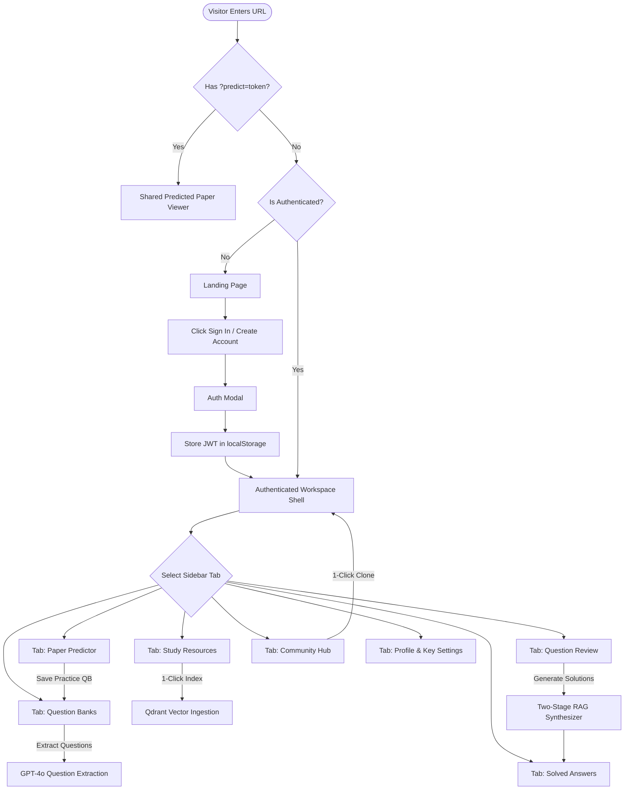
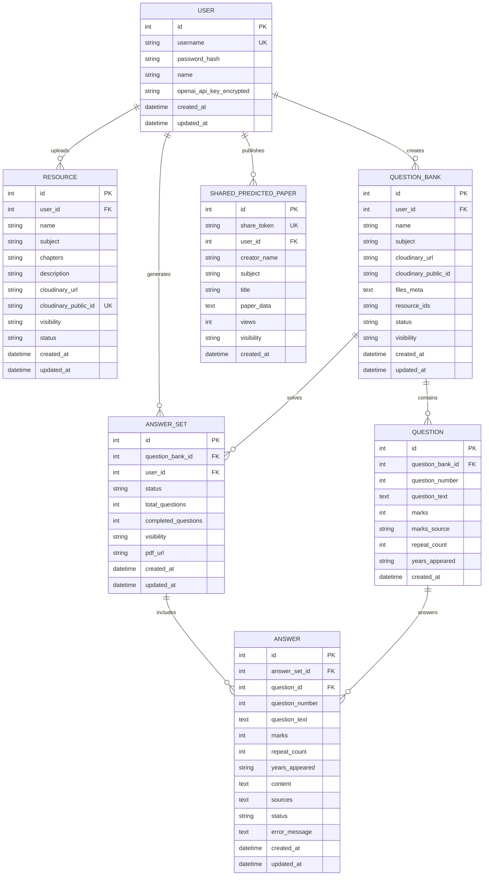
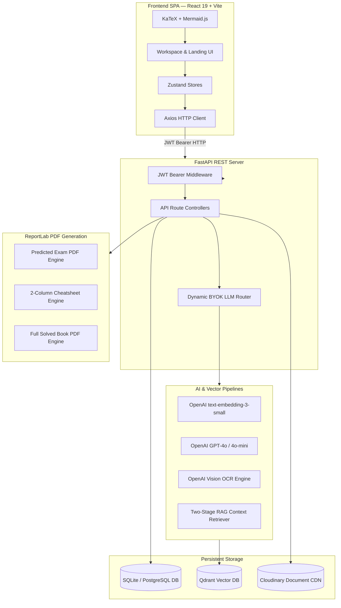

# AcademicStack — Comprehensive Project Documentation

> **Document Type:** Source of Truth & Complete System Blueprint  
> **Target Version:** 1.0.0  
> **Status:** Active & Implemented  
> **Last Maintained / Audited:** September 2026  

---

## Table of Contents

1. [Quick Project Summary (Read This First)](#-quick-project-summary-read-this-first)
2. [Project Overview](#1-project-overview)
3. [How to Run AcademicStack Locally](#-how-to-run-academicstack-locally)
4. [Complete Project Structure](#2-complete-project-structure)
5. [Frontend Architecture & Component Analysis](#3-frontend-architecture--component-analysis)
6. [Complete Route & Navigation Map](#4-complete-route--navigation-map)
7. [End-to-End User Flows](#5-end-to-end-user-flows)
8. [Backend Architecture & Module Analysis](#6-backend-architecture--module-analysis)
9. [Complete Backend API Documentation](#7-complete-backend-api-documentation)
10. [Frontend ↔ Backend API Contract & Data Flow](#8-frontend--backend-api-contract--data-flow)
11. [Database Schema & ER Analysis](#9-database-schema--er-analysis)
12. [System Architecture Diagram](#10-system-architecture-diagram)
13. [Feature Inventory & Implementation Status](#11-feature-inventory--implementation-status)
14. [Page-by-Page UI Inventory](#12-page-by-page-ui-inventory)
15. [Design System & Token Specifications](#13-design-system--token-specifications)
16. [Responsive Behavior & Breakpoint Audit](#14-responsive-behavior--breakpoint-audit)
17. [Authentication, Security & Encryption Architecture](#15-authentication-security--encryption-architecture)
18. [Error, Loading & Empty State Specifications](#16-error-loading--empty-state-specifications)
19. [Core Business Logic & Algorithmic Rules](#17-core-business-logic--algorithmic-rules)
20. [External Services & Cloud Integrations](#18-external-services--cloud-integrations)
21. [Environment Variables Specification](#19-environment-variables-specification)
22. [Dependencies & Package Audits](#20-dependencies--package-audits)
23. [UI Redesign Rules & Boundary Constraints](#21-ui-redesign-rules--boundary-constraints)
24. [Page Redesign Checklist & Preparation](#22-page-redesign-checklist--preparation)
25. [OpenDesign Handoff Specifications](#23-opendesign-handoff-specifications)
26. [Master System Project Map](#24-master-system-project-map)

---

# 🌟 QUICK PROJECT SUMMARY (READ THIS FIRST)

### What is AcademicStack in 3 Sentences?
**AcademicStack** is an intelligent AI exam preparation, blueprint prediction, and study resource collaboration platform for university students. 
Instead of spending weeks manually deciphering slide decks and solving years of past exam papers without official answer keys, a student uploads their **lecture notes/slides** and **past university exam papers (PDFs)**.
The system automatically extracts all questions, finds exact relevant paragraphs from the lecture notes using AI Vector Search (RAG), generates **verified step-by-step solutions with KaTeX math and Mermaid diagrams**, dynamically predicts **high-probability upcoming exam questions**, and enables 1-click PDF cheatsheet export and community asset sharing.

---

### The Real-World Problem It Solves

```text
┌──────────────────────────────────────────────────────────────────────────────────┐
│                             THE TRADITIONAL STUDENT STRUGGLE                     │
│                                                                                  │
│  1. 100s of messy slide PDFs & textbook chapters with no searchable index.        │
│  2. 5+ years of Past Exam Papers without official step-by-step solutions.       │
│  3. Standard ChatGPT hallucinations: Generates wrong formulas not in syllabus.   │
│  4. Manually making 2-column revision cheatsheets before exams takes 20+ hours.  │
│  5. Students repeatedly duplicate the same effort across college batches.        │
└──────────────────────────────────────────────────────────────────────────────────┘
                                        ▼
┌──────────────────────────────────────────────────────────────────────────────────┐
│                            THE ACADEMICSTACK SOLUTION                            │
│                                                                                  │
│  1. Upload Notes/Slides ────────► Embedded into Qdrant Vector DB in seconds.     │
│  2. Upload Past Papers ─────────► AI automatically extracts & categorizes every Q│
│  3. Two-Stage RAG Solutions ────► Answers strictly grounded in uploaded notes.   │
│  4. Exam Predictor ─────────────► Analyzes past frequencies to forecast papers.  │
│  5. 1-Click Export & Clone ─────► Clean 2-column cheatsheet PDFs + Community Hub.│
└──────────────────────────────────────────────────────────────────────────────────┘
```

---

### Step-by-Step How It Works (The 5-Step Lifecycle)

1. **Step 1: Upload Study Resources (Notes / Slides)**
   - The user uploads lecture PDFs or textbook chapters.
   - The backend extracts text, splits it into semantic chunks (1000 chars, 200 overlap), computes 1536-dimensional OpenAI vector embeddings (`text-embedding-3-small`), and stores them in **Qdrant Vector Database**.
2. **Step 2: Upload Question Papers & Auto-Parse**
   - The user uploads past university exam papers (PDFs).
   - GPT-4o analyzes the document layout and automatically extracts individual questions, sub-parts, marks (e.g., 2 marks, 5 marks, 10 marks), and recurrence metadata. For scanned PDFs or unmapped font glyphs, an automatic **OpenAI Vision OCR fallback** guarantees 100% extraction accuracy.
3. **Step 3: Review & Edit Questions**
   - The user audits the parsed question list, adjusts marks, reorders questions, or adds custom questions.
4. **Step 4: AI Solution Synthesis (Two-Stage Grounded RAG)**
   - For each question, AcademicStack performs dense vector search inside the user's uploaded lecture notes to retrieve exact contextual chunks.
   - **Phase 1 (Draft)**: Synthesizes a structured answer complete with a **2-Minute Quick Recall block**, **KaTeX mathematical formulas**, and **Mermaid flowcharts**.
   - **Phase 2 (Senior Academic Reviewer)**: Audits the draft against marks allotment, verifies syllabus keywords, checks diagram syntax, and enforces marks-proportional length scaling (2 marks: ~60–100w, 5–7 marks: ~200–300w, 10+ marks: ~450–600w).
   - Solutions can be downloaded as an **official full-length solutions PDF** or an **ultra-compact 2-column examination revision cheatsheet**.
5. **Step 5: Exam Paper Prediction & Community Sharing**
   - The predictor analyzes question recurrence and module weightage across up to 10 past papers without rigid hardcoded templates to synthesize an authentic **high-yield predicted exam paper** with complete choice pools.
   - Users can publish their question banks, answer keys, or predicted papers to **The Commons (Community Hub)** so batchmates can view or **1-click clone** into their own workspace.

---

# 🚀 HOW TO RUN ACADEMICSTACK LOCALLY

### Prerequisites
- **Node.js (v18+)** & `npm`
- **Python (v3.11+)** & `pip`
- **OpenAI API Key** (or provide your own personal key in the app Profile tab)
- **Qdrant Vector Database** (Cloud cluster or local instance)
- **Cloudinary Account** (for raw PDF storage)

### 1. Backend Setup
```bash
# Navigate to backend directory
cd as-backend

# Create and activate a Python virtual environment
python -m venv venv

# On Windows PowerShell:
.\venv\Scripts\Activate.ps1
# On macOS/Linux:
source venv/bin/activate

# Install dependencies
pip install -r requirements.txt

# Create .env from template and configure keys
cp .env.example .env

# Run the FastAPI server (starts on http://127.0.0.1:8000)
uvicorn app.main:app --reload --host 127.0.0.1 --port 8000
```

### 2. Frontend Setup
```bash
# In a new terminal, navigate to frontend directory
cd as-frontend

# Install node dependencies
npm install

# Start the Vite development server (starts on http://localhost:5173)
npm run dev
```

### 3. Open in Browser
Visit `http://localhost:5173` to access the full application. Interactive backend API docs are available at `http://127.0.0.1:8000/docs`.

---

# 1. PROJECT OVERVIEW

### What is AcademicStack?
**AcademicStack** is an intelligent, RAG-grounded academic revision, exam prediction, and study resource collaboration platform for university and college students. It bridges the gap between raw, unstructured lecture materials (slides, textbooks, syllabi) and historical university question papers by using AI to parse past exam trends, generate step-by-step verified solutions with mathematical proofs & Mermaid diagrams, synthesize high-probability model exam papers, and enable seamless community sharing and 1-click workspace cloning.

### Main Purpose
- Transform scattered PDF notes and past year papers into structured, high-yield study assets.
- Ensure all AI-generated answers are strictly **RAG-grounded** in uploaded course notes to prevent hallucinated curriculum content.
- Provide a data-driven **Exam Paper Predictor** that computes probability scores and historical recurrence patterns with dynamic zero-assumption blueprints.
- Empower students to share high-quality question banks, solved answer sets, and predicted model papers with classmates without duplicating manual synthesis work.

### Target Users
- **Undergraduate & Postgraduate Students**: Preparing for end-semester, mid-term, or competitive university exams.
- **Academic Study Groups / Class Reps**: Creating and publishing unified course answer keys and curated question banks for entire batches.
- **Self-Directed Learners**: Seeking active recall practice and topic-wise revision directly mapped to textbook chapters.

### Core Technology Stack
- **Frontend Framework**: React 19 (SPA) with Vite 6
- **Styling**: TailwindCSS v4 with custom warm-paper design tokens (`#0057FF`, `#19243B`, `#526078`, `#E2E0D9`, `#F8F7F4`)
- **State Management**: Zustand v5 (Persisted stores with `localStorage`)
- **Scientific & Diagram Rendering**: KaTeX (via `rehype-katex`, `remark-math`), Mermaid.js v11, `react-markdown`, `remark-gfm`
- **Backend Framework**: Python 3.11+ with FastAPI & Uvicorn
- **Database**: SQLite (local development) / PostgreSQL-compatible via SQLAlchemy ORM & Alembic/SQLModel patterns
- **Vector Database**: Qdrant (Cloud / Local vector collection for RAG dense semantic search)
- **Embeddings & LLM**: OpenAI `text-embedding-3-small` (1536-dim vectors) and `gpt-4o-mini` / `gpt-4o`
- **Cloud File Storage**: Cloudinary (Secure raw PDF and document upload with public signed delivery)
- **PDF Engine**: ReportLab (Custom multi-column formatting, vector geometry, dynamic font registration)
- **Authentication**: Stateless JWT (JSON Web Tokens) with Bearer header, client-side AES-256 encrypted at rest API keys

---

# 2. COMPLETE PROJECT STRUCTURE

```text
AcademicStack/
├── as-frontend/                            # Frontend Single Page Application
│   ├── public/
│   │   └── favicon.svg                     # Custom AcademicStack Isometric Logo Favicon
│   ├── src/
│   │   ├── api/
│   │   │   └── client.js                   # Axios client instance with Bearer interceptors & error normalizing
│   │   ├── components/
│   │   │   ├── ui/
│   │   │   │   ├── AcademicLogo.jsx        # Standardized vector SVG logo component
│   │   │   │   ├── ApiKeyBanner.jsx        # Warning banner displayed when OpenAI API key is missing
│   │   │   │   ├── EmptyState.jsx          # Generic empty state UI placeholder with illustrations
│   │   │   │   ├── StatusBadge.jsx         # Uniform status indicators (Uploaded, Indexing, Ready, Error)
│   │   │   │   └── ThemeToggle.jsx         # Dark/Light theme mode switch
│   │   │   ├── AddQuestionModal.jsx        # Modal to manually add a question to an existing bank
│   │   │   ├── AiProgressModal.jsx         # Centered modal displaying AI pipeline status spinner
│   │   │   ├── AnswerCard.jsx              # Rich Markdown/LaTeX/Mermaid answer card with retry & edit
│   │   │   ├── ApiKeyRequiredModal.jsx     # Dialog blocking actions when OpenAI key is missing
│   │   │   ├── AuthModal.jsx               # Tabbed Login / Registration modal
│   │   │   ├── CommunityAnswerViewer.jsx   # Dedicated full-page viewer for community solved papers
│   │   │   ├── CommunityHub.jsx            # Tabbed discovery feed (Question Banks, Solved Sets, Predicted Papers)
│   │   │   ├── CommunityPredictedPaperViewer.jsx # Full-page viewer for shared predicted model exams
│   │   │   ├── CommunityQuestionBankViewer.jsx   # Full-page viewer for shared question banks
│   │   │   ├── ConfirmationModal.jsx       # Standard reusable destructive & action confirmation modal
│   │   │   ├── ErrorModal.jsx              # Global error dialog for API failures
│   │   │   ├── LandingPage.jsx             # Public marketing page with interactive 3D perspective mockup
│   │   │   ├── MermaidDiagram.jsx          # Dynamic SVG renderer for AI-generated Mermaid flowcharts & graphs
│   │   │   ├── Navbar.jsx                  # Top navigation bar with user profile dropdown
│   │   │   ├── PredictedPaperGenerator.jsx # AI Exam Blueprint generator and predicted paper workspace
│   │   │   ├── ProfileSettings.jsx         # Dedicated personal OpenAI API key configuration UI
│   │   │   ├── QuestionBankManager.jsx     # Past exam paper upload, linking, and AI extraction
│   │   │   ├── QuestionCard.jsx            # Question item card in review list with editable marks
│   │   │   ├── QuestionReview.jsx          # Pre-generation audit of parsed questions with mark tally
│   │   │   ├── ResourceManager.jsx         # PDF note/slide upload, vector indexing, and status tracker
│   │   │   ├── SolutionViewer.jsx          # Grounded solution viewer with LaTeX math, citations, and PDF export
│   │   │   └── WorkspaceLayout.jsx         # Authenticated app shell with collapsible sidebar & mobile drawer
│   │   ├── store/
│   │   │   ├── useAuthStore.js             # Authentication state, user profile, JWT token management
│   │   │   ├── usePracticeStore.js         # Practice mode tracking, answer hidden/revealed toggles
│   │   │   ├── useQuestionBankStore.js     # Primary data store for resources, QBs, questions, answers, community
│   │   │   └── useThemeStore.js            # Theme state persistence (light/dark)
│   │   ├── App.jsx                         # Main orchestrator mounting Layout, Modals, and active Tab
│   │   ├── index.css                       # Design tokens, typography, KaTeX overrides, Tailwind imports
│   │   └── main.jsx                        # React root entry point
│   ├── index.html                          # HTML shell with KaTeX stylesheet link
│   ├── package.json                        # NPM package dependencies and scripts
│   └── vite.config.js                      # Vite build configuration with TailwindCSS plugin
│
├── as-backend/                             # FastAPI Python REST Backend
│   ├── app/
│   │   ├── answers/
│   │   │   ├── routes.py                   # Endpoints for answer generation, PDF download, retry, progress
│   │   │   ├── schemas.py                  # Pydantic schemas for Answer, AnswerSet, AnswerProgress
│   │   │   └── service.py                  # RAG answer synthesis service, background question answering
│   │   ├── community/
│   │   │   └── routes.py                   # Public discovery, sharing, and workspace cloning endpoints
│   │   ├── core/
│   │   │   ├── config.py                   # Pydantic BaseSettings loading environment variables
│   │   │   └── security.py                 # JWT token encoding/decoding, bcrypt password hashing
│   │   ├── db/
│   │   │   ├── database.py                 # SQLAlchemy engine, sessionmaker, Base class
│   │   │   ├── init_db.py                  # Auto table creation and SQLite foreign key enforcement
│   │   │   └── models.py                   # SQLAlchemy DB models (User, Resource, QB, Question, etc.)
│   │   ├── indexing/
│   │   │   ├── routes.py                   # Resource vectorization/indexing endpoint (`/api/resources/{id}/index`)
│   │   │   └── service.py                  # PDF text extraction, chunking, embedding generation & Qdrant upsert
│   │   ├── llm/
│   │   │   ├── router.py                   # Dynamic LLM routing (user API key vs fallback system key) + Vision OCR
│   │   │   └── service.py                  # Core OpenAI GPT completion invocation wrapper
│   │   ├── parsing/
│   │   │   └── question_parser.py          # Multi-strategy question extraction from PDF files via GPT-4o
│   │   ├── pdf/
│   │   │   ├── assets/fonts/               # DejaVu font families for ReportLab vector typography
│   │   │   ├── cheatsheet_generator.py     # 2-column ultra-dense printable exam cheatsheet PDF builder
│   │   │   ├── fonts.py                    # Helvetica / DejaVu custom font registrations
│   │   │   ├── generator.py                # Solved book ReportLab canvas with custom header, page numbers, formatting
│   │   │   ├── mathrender.py               # LaTeX to ReportLab Drawing parser / renderer
│   │   │   ├── predicted_paper_generator.py# Formal university examination paper PDF builder
│   │   │   └── questions_generator.py      # Question bank question sheet PDF builder
│   │   ├── predictor/
│   │   │   ├── routes.py                   # Multi-paper analysis, blueprint generation, PDF export, share links
│   │   │   └── service.py                  # Statistical topic weighting, frequency analysis & model paper builder
│   │   ├── question_banks/
│   │   │   ├── routes.py                   # Question bank CRUD, file upload, question extraction, PDF export
│   │   │   ├── schemas.py                  # Pydantic request/response schemas for question banks
│   │   │   └── service.py                  # QB creation, Cloudinary upload, question extraction runner
│   │   ├── questions/
│   │   │   ├── routes.py                   # Individual question update and deletion routes
│   │   │   ├── schemas.py                  # Pydantic schemas for Question payload
│   │   │   └── service.py                  # Question database management
│   │   ├── rag/
│   │   │   ├── embeddings.py               # OpenAI text-embedding-3-small wrapper
│   │   │   ├── retriever.py                # Context retrieval with subject filtering from Qdrant
│   │   │   ├── service.py                  # Two-stage RAG coordinator (Draft + Reviewer with math & Mermaid)
│   │   │   └── vector_store.py             # Qdrant client connection & collection management
│   │   ├── resources/
│   │   │   ├── routes.py                   # Study resource upload, listing, download, deletion
│   │   │   ├── schemas.py                  # Pydantic schemas for Resource entity
│   │   │   └── service.py                  # Cloudinary document upload & DB resource management
│   │   ├── storage/
│   │   │   └── cloudinary.py               # Cloudinary upload, download stream, and resource deletion
│   │   ├── users/
│   │   │   ├── routes.py                   # Auth endpoints (register, login, me, set/delete openai key)
│   │   │   ├── schemas.py                  # User authentication & profile schemas
│   │   │   └── service.py                  # User DB queries & password verification
│   │   ├── utils/
│   │   │   ├── encryption.py               # AES-256 GCM encryption for user API keys at rest
│   │   │   └── error_messages.py           # Standardized user-friendly error formatting
│   │   ├── vector_store/
│   │   │   └── qdrant.py                   # Qdrant client helper and collection initializer
│   │   └── main.py                         # FastAPI application entrypoint, CORS, routers & health check
│   ├── Dockerfile                          # Backend container configuration
│   ├── docker-compose.yml                  # Container orchestration specification
│   └── requirements.txt                    # Python dependencies
│
├── README.md                               # Project documentation overview & quickstart
└── PROJECT_DOCUMENTATION.md                # Comprehensive Source of Truth Document
```

---

# 3. FRONTEND ARCHITECTURE & COMPONENT ANALYSIS

The frontend is structured as a high-performance **Tabbed Single Page Application (SPA)** wrapped inside an adaptive workspace shell (`WorkspaceLayout.jsx`) when authenticated, and an interactive presentation page (`LandingPage.jsx`) when unauthenticated.

### Primary Layout & Navigation Shells
1. **`LandingPage.jsx`**:
   - **Access**: Public / Unauthenticated.
   - **Visuals**: Modern isometric 3D workspace preview (`[perspective:1600px]`), live SVG Resource Allocation Graph demo, value proposition hero, "How it works" breakdown, feature cards, and direct CTAs to open the authentication modal.
2. **`WorkspaceLayout.jsx`**:
   - **Access**: Authenticated users only.
   - **Structure**: Collapsible left navigation rail (Desktop) + slide-over drawer (Mobile/Tablet) + sticky header with page context and User avatar menu.
   - **Navigation Tabs**:
     - `resources`: Study Resources Manager
     - `question_banks`: Question Bank Manager
     - `review`: Question Review & Organization
     - `solutions`: Solved Answers & Cheatsheets
     - `predictor`: AI Paper Predictor & Blueprint
     - `community`: Community Hub Discovery (The Commons)
     - `profile`: OpenAI API Key & Account Management

### Core Workspace Tab Components
1. **`ResourceManager.jsx` (Tab: `resources`)**:
   - **Purpose**: Uploads lecture notes, textbooks, and syllabus PDFs.
   - **Features**: Drag-and-drop file upload with Cloudinary direct ingestion, metadata forms (Subject, Chapters, Description), and 1-click **Vector Indexing** that triggers asynchronous chunking and Qdrant vector database ingestion.
2. **`QuestionBankManager.jsx` (Tab: `question_banks`)**:
   - **Purpose**: Manages historical question papers.
   - **Features**: Uploads past exam PDFs, links them to indexed Study Resources, and triggers AI Question Extraction to automatically parse questions, marks, and year recurrences.
3. **`QuestionReview.jsx` (Tab: `review`)**:
   - **Purpose**: Pre-generation audit of parsed questions.
   - **Features**: Allows students to edit question text, modify assigned marks, delete invalid questions, manually add custom questions, and trigger grounded answer generation.
4. **`SolutionViewer.jsx` (Tab: `solutions`)**:
   - **Purpose**: Study and read verified, RAG-grounded solutions.
   - **Features**: Full KaTeX math equation rendering, dynamic Mermaid diagrams, source citation badges, individual question re-solve / retry with custom revision prompts, and 1-click export to **Full Solved PDF** or **Printable 2-Column Cheatsheet PDF**.
5. **`PredictedPaperGenerator.jsx` (Tab: `predictor`)**:
   - **Purpose**: AI Exam Blueprint synthesis and practice paper generation.
   - **Features**: Analyzes historical question papers to calculate unit-wise marks distribution, recurring themes, and generate a standardized model examination paper with shareable link generation and formal PDF download.
6. **`CommunityHub.jsx` (Tab: `community`)**:
   - **Purpose**: Peer-to-peer study asset exchange (The Commons).
   - **Features**: 3 dedicated feeds: (1) Shared Question Banks, (2) Solved Answer Sets, (3) Predicted Model Papers. Features search, subject filters, read-only full preview modals, and **1-Click Clone to Workspace**.
7. **`ProfileSettings.jsx` (Tab: `profile`)**:
   - **Purpose**: Dedicated OpenAI API key configuration.
   - **Features**: Minimal, secure input with masked key display, "Save Key", and "Remove Key" confirmation modal.

### Modals & Dialog System
- **`AuthModal.jsx`**: Manages Login and Register with instant client-side validation.
- **`AiProgressModal.jsx`**: Non-blocking animated loader communicating real-time AI indexing, question extraction, answer synthesis, and blueprint generation status.
- **`ApiKeyRequiredModal.jsx`**: Intercepts actions requiring OpenAI inference if the student has not saved an API key.
- **`ConfirmationModal.jsx`**: Reusable modal for destructive deletions and custom re-generation prompts.
- **`ErrorModal.jsx`**: Global error handler displaying formatted failure reasons with dismiss actions.
- **`AddQuestionModal.jsx`**: Form for adding standalone questions with marks and topic tags.

---

# 4. COMPLETE ROUTE & NAVIGATION MAP

Because AcademicStack is built as a state-driven SPA with URL token support for viral sharing, navigation is coordinated via Zustand (`useQuestionBankStore` and `useAuthStore`) and query parameters:

| URL Pattern | Active Mode / Tab | Access | Purpose | Primary APIs Triggered |
| :--- | :--- | :--- | :--- | :--- |
| `/` | `LandingPage` (if unauth) | Public | Product overview & auth entry | None |
| `/?predict=<token>` | `SharedPredictedPaperViewer` | Public / Token | View shared model exam paper | `GET /api/predictor/shared/{token}` |
| `/` (authenticated) | `WorkspaceLayout` (`resources`) | Private | Study material management | `GET /api/resources`, `GET /api/auth/me` |
| `tab: question_banks` | `QuestionBankManager` | Private | Question paper upload & extraction | `GET /api/question-banks`, `GET /api/resources` |
| `tab: review` | `QuestionReview` | Private | Review parsed questions | `GET /api/question-banks/{id}/questions` |
| `tab: solutions` | `SolutionViewer` | Private | Read RAG solutions & diagrams | `GET /api/answer-sets/{id}` |
| `tab: predictor` | `PredictedPaperGenerator` | Private | Predict high-yield exam papers | `POST /api/predictor/generate`, `POST /api/predictor/save-as-qb`, `POST /api/predictor/share` |
| `tab: community` | `CommunityHub` | Private | Browse shared community resources | `GET /api/community/resources`, `GET /api/community/answer-sets`, `GET /api/community/predicted-papers` |
| `tab: profile` | `ProfileSettings` | Private | OpenAI API key management | `PUT /api/auth/profile/openai-key`, `DELETE /api/auth/profile/openai-key` |

### Application Flowchart


---

# 5. END-TO-END USER FLOWS

### 1. Registration & Authentication Flow
1. User clicks **"Create account"** on Landing Page or Navbar.
2. `AuthModal` opens; user enters Name, Username, and Password.
3. Client sends `POST /api/auth/register`.
4. Backend hashes password using `bcrypt`, generates signed JWT, and returns `access_token` and user profile.
5. Client saves token in `localStorage('academicstack_token')` and updates Zustand `useAuthStore`.
6. UI immediately transitions from Landing Page to `WorkspaceLayout`.

### 2. Study Resource Upload & Vector Indexing Flow
1. Student navigates to **Study Resources** tab.
2. Selects PDF file (lecture notes or syllabus), inputs Subject name and Chapters covered.
3. Client uploads PDF via `POST /api/resources` (multipart form data).
4. Backend streams file to Cloudinary, persists resource record with status `uploaded`.
5. Student clicks **"Index Resource"**.
6. Client invokes `POST /api/resources/{resource_id}/index`.
7. Backend downloads PDF, splits text into overlapping semantic chunks (1000 chars, 200 overlap), computes embeddings via `text-embedding-3-small`, and stores payload into Qdrant collection `academic_resources`.
8. Resource status updates to `indexed`.

### 3. Question Bank Ingestion & AI Question Extraction Flow
1. Student navigates to **Question Banks** tab and clicks **"Upload Question Paper"**.
2. Uploads university past paper PDF, provides Subject and Name, and selects linked Study Resources.
3. Client executes `POST /api/question-banks`.
4. Once uploaded, student clicks **"Extract Questions"**.
5. Client invokes `POST /api/question-banks/{id}/extract`.
6. Backend routes to GPT-4o with specialized academic extraction prompt to structure questions into `question_number`, `question_text`, `marks`, and recurrence counts. If text extraction is unreadable due to scanned photocopies, Vision OCR fallback extracts questions visually.
7. Questions are inserted into `questions` table; client auto-routes student to **Question Review** tab.

### 4. Grounded Solution Synthesis & Verification Flow
1. In **Question Review**, student audits questions and clicks **"Generate All Answers"**.
2. Client checks if OpenAI key is present; if missing, opens `ApiKeyRequiredModal`.
3. Client calls `POST /api/answer-sets/generate` with `question_bank_id`.
4. Backend creates `answer_sets` record (status: `generating`) and initiates parallel background answering:
   - For each question: searches Qdrant vector database for top matching chunks matching the QB's linked subject.
   - **Draft Stage**: Prompts GPT-4o with retrieved context chunks, generating 2-Min Quick Recall block, structured explanations, LaTeX math, and Mermaid flowcharts.
   - **Reviewer Stage**: Senior Academic Reviewer audits formatting, enforces marks-proportional length, validates Mermaid syntax, and ensures complete step-by-step worked numerical solutions.
5. Client polls `GET /api/answer-sets/{id}/progress` until completion.
6. Student reviews solutions in **Solved Answers** tab with option to re-solve specific questions with feedback prompts (`POST /api/answers/{id}/retry`).

### 5. Exam Paper Predictor & Blueprint Synthesis Flow
1. Student navigates to **Paper Predictor** tab.
2. Selects multiple past exam papers (uploaded PDFs or existing Question Banks).
3. Clicks **"Synthesize Blueprint & Predict Paper"** (`POST /api/predictor/generate`).
4. Backend dynamically audits the papers without template assumptions, counts main questions and sub-question pools (e.g. generating all 6 sub-questions for an "Answer Any 4" question), and synthesizes a complete model exam paper.
5. Student can:
   - Download formal Examination PDF (`POST /api/predictor/pdf`).
   - Clone predicted paper as an editable Question Bank (`POST /api/predictor/save-as-qb`).
   - Create public share link (`POST /api/predictor/share`).

### 6. Community Hub Discovery & 1-Click Workspace Cloning Flow
1. Student navigates to **Community Hub** (The Commons).
2. Explores shared Question Banks, Solved Answer Sets, or Predicted Papers published by other students.
3. Clicks **"Add to Workspace"** on any item.
4. Client sends clone request (`POST /api/community/.../clone`).
5. Backend duplicates records and questions into the user's private workspace.
6. Button locks to **"Copied"** (disabled) and updates global store Sets to prevent redundant duplicates.

---

# 6. BACKEND ARCHITECTURE & MODULE ANALYSIS

```text
as-backend/app/
├── core/           # Security, Settings, JWT, Config
├── db/             # SQLAlchemy Engine, Session, Models
├── storage/        # Cloudinary direct storage connector
├── vector_store/   # Qdrant client & collection management
├── rag/            # Vector embeddings, contextual retrieval, Two-Stage RAG coordinator
├── llm/            # Dynamic BYOK LLM Router & OpenAI Vision OCR fallback
├── users/          # Authentication, user CRUD, AES key encryption
├── resources/      # Study note PDF management & indexing
├── indexing/       # Text chunking & vector database ingestion service
├── question_banks/ # QB upload, question extraction, PDF export
├── questions/      # Question CRUD & mark modifications
├── answers/        # RAG solution synthesis, cheatsheet generation
├── predictor/      # Statistical exam paper prediction & share tokens
├── community/      # Public discovery, sharing & cloning logic
└── pdf/            # ReportLab custom typography & PDF layout engines
```

### Key Subsystems:
1. **Dynamic BYOK (Bring Your Own Key) LLM Router (`app/llm/router.py`)**:
   - Checks if the authenticated user has configured an encrypted OpenAI API key.
   - If present, decrypts the key in memory for inference; otherwise falls back to system environment key if permitted or prompts for key configuration.
2. **AES-256 GCM Key Encryption (`app/utils/encryption.py`)**:
   - User OpenAI API keys are encrypted at rest using AES-256 GCM with PBKDF2 HMAC-SHA256 key derivation (100,000 iterations) and random 12-byte initialization vectors (IV). Keys are never logged or stored in plaintext.
3. **OpenAI Vision OCR Fallback (`app/llm/router.py`, `app/predictor/service.py`)**:
   - Automatically detects scanned photocopies or unmapped PDF character glyphs and renders high-DPI page bitmaps for direct Vision transcription.
4. **ReportLab Math & Flowchart PDF Engine (`app/pdf/`)**:
   - Custom-built PDF generators utilizing ReportLab Flowables, DejaVu typography, automatic two-column cheatsheet pagination, and vector math integration.

---

# 7. COMPLETE BACKEND API DOCUMENTATION

| Method | Endpoint | Auth Required | Purpose | Request Body | Response Body | Caller Component |
| :--- | :--- | :---: | :--- | :--- | :--- | :--- |
| `POST` | `/api/auth/register` | No | Register new student account | `{username, password, name}` | `{access_token, token_type, user}` | `AuthModal.jsx` |
| `POST` | `/api/auth/login` | No | Authenticate user & issue JWT | `{username, password}` | `{access_token, token_type, user}` | `AuthModal.jsx` |
| `GET` | `/api/auth/me` | Yes | Get current user profile & key status | None | `UserProfileResponse` | `useAuthStore.js` |
| `PUT` | `/api/auth/profile/openai-key` | Yes | Save/update encrypted OpenAI API key | `{openai_api_key}` | `UserProfileResponse` | `ProfileSettings.jsx` |
| `DELETE` | `/api/auth/profile/openai-key` | Yes | Remove saved OpenAI API key | None | `UserProfileResponse` | `ProfileSettings.jsx` |
| `POST` | `/api/resources` | Yes | Upload study notes/slides PDF | Multipart Form (`file`, `subject`, `name`, etc.) | `ResourceResponse` | `ResourceManager.jsx` |
| `GET` | `/api/resources` | Yes | List user's study resources | Query: `?user_id=` | `ResourceListResponse` | `ResourceManager.jsx` |
| `GET` | `/api/resources/{id}` | Yes | Get single resource details | None | `ResourceResponse` | `ResourceManager.jsx` |
| `DELETE` | `/api/resources/{id}` | Yes | Delete resource & vector chunks | None | `{message, resource_id}` | `ResourceManager.jsx` |
| `GET` | `/api/resources/{id}/download` | Yes | Download original resource PDF | None | PDF File Stream | `ResourceManager.jsx` |
| `POST` | `/api/resources/{id}/index` | Yes | Index resource into Qdrant vectors | None | `{message, resource_id, chunks_indexed}` | `ResourceManager.jsx` |
| `POST` | `/api/question-banks` | Yes | Upload question paper PDF | Multipart Form (`files`, `name`, `subject`, `resource_ids`) | `QuestionBankResponse` | `QuestionBankManager.jsx` |
| `GET` | `/api/question-banks` | Yes | List user's question banks | Query: `?user_id=` | `QuestionBankListResponse` | `QuestionBankManager.jsx` |
| `GET` | `/api/question-banks/{id}` | Yes | Get question bank details | None | `QuestionBankResponse` | `QuestionBankManager.jsx` |
| `POST` | `/api/question-banks/{id}/extract` | Yes | AI extract questions from QB PDF | None | `{message, questions_extracted}` | `QuestionBankManager.jsx` |
| `GET` | `/api/question-banks/{id}/questions` | Yes | List questions in question bank | None | `QuestionListResponse` | `QuestionReview.jsx` |
| `POST` | `/api/question-banks/{id}/questions` | Yes | Manually add question to bank | `QuestionCreate` | `QuestionResponse` | `AddQuestionModal.jsx` |
| `GET` | `/api/question-banks/{id}/download` | Yes | Download raw QB PDF | None | PDF File Stream | `QuestionBankManager.jsx` |
| `GET` | `/api/question-banks/{id}/questions-pdf`| Yes | Download generated Question Sheet | None | PDF File Stream | `QuestionBankManager.jsx` |
| `PATCH`| `/api/question-banks/{id}/visibility` | Yes | Toggle public/private visibility | Form: `visibility` | `QuestionBankResponse` | `QuestionBankManager.jsx` |
| `PUT` | `/api/questions/{id}` | Yes | Edit question text / marks | `QuestionUpdate` | `QuestionResponse` | `QuestionReview.jsx` |
| `DELETE`| `/api/questions/{id}` | Yes | Delete question from bank | None | `{message, question_id}` | `QuestionReview.jsx` |
| `POST` | `/api/answer-sets/generate` | Yes | Trigger RAG grounded answer generation | `GenerateAnswerSetRequest` | `AnswerSetResponse` | `QuestionReview.jsx` |
| `GET` | `/api/answer-sets/{id}` | Yes | Get answer set with answers | None | `AnswerSetResponse` | `SolutionViewer.jsx` |
| `GET` | `/api/answer-sets/{id}/pdf` | Yes | Download full Solved Paper PDF | None | PDF File Stream | `SolutionViewer.jsx` |
| `GET` | `/api/answer-sets/{id}/cheatsheet-pdf`| Yes | Download 2-column Cheatsheet PDF | None | PDF File Stream | `SolutionViewer.jsx` |
| `GET` | `/api/answer-sets/{id}/progress`| Yes | Poll generation progress | None | `AnswerSetProgressResponse` | `SolutionViewer.jsx` |
| `POST` | `/api/answers/{id}/retry` | Yes | Re-generate single question answer | `RetryAnswerRequest` | `AnswerResponse` | `AnswerCard.jsx` |
| `GET` | `/api/question-banks/{id}/answer-sets`| Yes | List answer sets for a QB | None | `List[AnswerSet]` | `SolutionViewer.jsx` |
| `PATCH`| `/api/answer-sets/{id}/visibility`| Yes | Toggle answer set visibility | `{visibility: "public" \| "private"}` | `AnswerSetResponse` | `SolutionViewer.jsx` |
| `POST` | `/api/predictor/generate` | Yes | Analyze papers & forecast blueprint | Form + Multipart PDF Files | `PredictedPaperData` | `PredictedPaperGenerator.jsx` |
| `POST` | `/api/predictor/save-as-qb` | Yes | Save predicted paper as Question Bank | `{user_id, paper_data}` | `SaveAsQBResponse` | `PredictedPaperGenerator.jsx` |
| `POST` | `/api/predictor/pdf` | Yes | Download model examination PDF | `{paper_data}` | PDF File Stream | `PredictedPaperGenerator.jsx` |
| `POST` | `/api/predictor/share` | Yes | Generate shareable link token | `{paper_data, user_id, ...}` | `ShareResponse` | `PredictedPaperGenerator.jsx` |
| `GET` | `/api/predictor/shared/{token}` | No | Access public predicted model paper | Path: `token` | `SharedPredictedPaperDetail` | `CommunityPredictedPaperViewer.jsx` |
| `GET` | `/api/community/resources` | Yes | Discover community study resources | None | `{resources: [...]}` | `CommunityHub.jsx` |
| `POST` | `/api/community/resources/{id}/share` | Yes | Toggle resource public sharing | None | `{message, resource_id, visibility}` | `ResourceManager.jsx` |
| `GET` | `/api/community/question-banks` | Yes | Discover community question banks | None | `{question_banks: [...]}` | `CommunityHub.jsx` |
| `POST` | `/api/community/question-banks/{id}/share`| Yes | Toggle QB public sharing | None | `{message, id, visibility}` | `QuestionBankManager.jsx` |
| `GET` | `/api/community/question-banks/{id}/questions`| Yes | Preview questions in shared QB | None | `{question_bank, questions}` | `CommunityQuestionBankViewer.jsx` |
| `POST` | `/api/community/question-banks/{id}/clone`| Yes | Clone community QB to workspace | None | `{message, question_bank}` | `CommunityHub.jsx` |
| `GET` | `/api/community/answer-sets` | Yes | Discover community solved answer sets | None | `{answer_sets: [...]}` | `CommunityHub.jsx` |
| `POST` | `/api/community/answer-sets/{id}/share` | Yes | Toggle answer set public sharing | None | `{message, answer_set_id, visibility}` | `SolutionViewer.jsx` |
| `POST` | `/api/community/answer-sets/{id}/share-update`| Yes | Share updated answer set & retire old | None | `{message, answer_set_id, retired_ids}` | `SolutionViewer.jsx` |
| `GET` | `/api/community/answer-sets/{id}/answers` | Yes | View answers in shared answer set | None | `CommunityAnswerSetDetail` | `CommunityAnswerViewer.jsx` |
| `POST` | `/api/community/answer-sets/{id}/clone` | Yes | Clone community answer set | None | `{message, question_bank_id, answer_set_id}` | `CommunityHub.jsx` |
| `GET` | `/api/community/predicted-papers` | Yes | Discover community predicted papers | None | `{predicted_papers: [...]}` | `CommunityHub.jsx` |
| `GET` | `/api/community/predicted-papers/{id}` | Yes | View shared predicted paper detail | None | `CommunityPredictedPaperDetail` | `CommunityPredictedPaperViewer.jsx` |
| `POST` | `/api/community/predicted-papers/{id}/toggle-share`| Yes | Toggle predicted paper public status | None | `{message, id, visibility}` | `CommunityHub.jsx` |
| `POST` | `/api/community/predicted-papers/{id}/clone`| Yes | Clone predicted paper as QB | None | `{message, question_bank}` | `CommunityHub.jsx` |
| `GET` | `/api/health` | No | Full service, DB & Qdrant health check | None | `{status, service, database, qdrant}` | Monitoring / Status |
| `GET` | `/api/health/db` | No | Database connection health check | None | `{status, database}` | Monitoring / Health |
| `GET` | `/api/health/qdrant` | No | Qdrant vector DB health check | None | `{status, qdrant}` | Monitoring / Health |

---

# 8. FRONTEND ↔ BACKEND API CONTRACT & DATA FLOW

| Frontend View / Trigger | User Action | HTTP Method & URL | Request Payload | Response Data | UI State Mutation |
| :--- | :--- | :--- | :--- | :--- | :--- |
| `AuthModal` | Submit Login | `POST /api/auth/login` | `{username, password}` | `{access_token, user}` | Set `isAuthenticated: true`, load profile, close modal |
| `ResourceManager` | Upload Note PDF | `POST /api/resources` | Multipart `FormData` | `Resource` object | Add item to `resources` list, status set to `uploaded` |
| `ResourceManager` | Click "Index" | `POST /api/resources/{id}/index` | None | `{chunks_indexed: number}` | Update status badge to `indexed`, show success toast |
| `QuestionBankManager` | Click "Extract" | `POST /api/question-banks/{id}/extract`| None | `{questions_extracted: number}` | Open `AiProgressModal`, navigate to `QuestionReview` tab |
| `QuestionReview` | Edit Marks | `PUT /api/questions/{id}` | `{marks: number, question_text}` | Updated `Question` | Update question marks badge and total marks counter |
| `QuestionReview` | Generate Answers | `POST /api/answer-sets/generate` | `{question_bank_id}` | `AnswerSet` header | Open progress tracker, redirect to `SolutionViewer` |
| `SolutionViewer` | Click "Download PDF"| `GET /api/answer-sets/{id}/pdf` | None | Raw PDF binary stream | Trigger browser file download dialog |
| `AnswerCard` | Re-solve Question | `POST /api/answers/{id}/retry` | `{user_instruction: string}` | Updated `Answer` | Re-render Markdown, KaTeX formulas, and Mermaid chart |
| `PredictedPaperGenerator`| Synthesize Paper | `POST /api/predictor/generate` | Form + PDF Files | Predicted JSON structure | Display blueprint sections and enable PDF download |
| `CommunityHub` | Clone Solved Set | `POST /api/community/answer-sets/{id}/clone` | None | Cloned `AnswerSet` | Mark button as "Copied", add QB to user workspace |

---

# 9. DATABASE SCHEMA & ER ANALYSIS



---

# 10. SYSTEM ARCHITECTURE DIAGRAM



---

# 11. FEATURE INVENTORY & IMPLEMENTATION STATUS

| Feature Module | Feature Item | Status | Backend Support | UI Support | Notes |
| :--- | :--- | :---: | :---: | :---: | :--- |
| **Authentication** | User Registration | ✅ Implemented | Yes (`/auth/register`) | `AuthModal.jsx` | Bcrypt hashing + JWT token |
| **Authentication** | User Login | ✅ Implemented | Yes (`/auth/login`) | `AuthModal.jsx` | Token stored in `localStorage` |
| **Authentication** | User Session Persistence | ✅ Implemented | Yes (`/auth/me`) | `useAuthStore.js` | Auto-restores session on boot |
| **Study Resources** | PDF Upload | ✅ Implemented | Yes (`/api/resources`) | `ResourceManager.jsx` | Cloudinary raw PDF upload |
| **Study Resources** | Qdrant Vector Indexing | ✅ Implemented | Yes (`/api/resources/{id}/index`)| `ResourceManager.jsx` | Chunking + OpenAI vector storage |
| **Study Resources** | Resource Deletion | ✅ Implemented | Yes (`DELETE /api/resources/{id}`)| `ResourceManager.jsx` | Deletes DB record + Qdrant vectors |
| **Question Banks** | QB PDF Ingestion | ✅ Implemented | Yes (`/api/question-banks`) | `QuestionBankManager.jsx`| Links to study resources |
| **Question Banks** | AI Question Extraction | ✅ Implemented | Yes (`/extract`) | `QuestionBankManager.jsx`| Multi-pass GPT-4o with Vision OCR fallback |
| **Question Review** | Question Editing / CRUD | ✅ Implemented | Yes (`/api/questions/{id}`) | `QuestionReview.jsx` | Real-time mark re-calculation |
| **Question Review** | Manual Question Add | ✅ Implemented | Yes (`POST /questions`) | `AddQuestionModal.jsx` | Custom addition with marks |
| **Solved Answers** | Grounded Two-Stage RAG | ✅ Implemented | Yes (`/answer-sets/generate`)| `SolutionViewer.jsx` | Vector search + Draft & Review pipeline |
| **Solved Answers** | 2-Min Quick Recall Blocks| ✅ Implemented | Yes (Synthesized in RAG) | `AnswerCard.jsx` | High-yield exam takeaway header |
| **Solved Answers** | Mathematical Formulas | ✅ Implemented | Yes (LaTeX output) | KaTeX Math Rendering | Inline & block LaTeX math support |
| **Solved Answers** | Mermaid Flowcharts | ✅ Implemented | Yes (Mermaid blocks) | `MermaidDiagram.jsx` | Auto-rendered SVG diagrams |
| **Solved Answers** | Cheatsheet PDF Export | ✅ Implemented | Yes (`/cheatsheet-pdf`) | `SolutionViewer.jsx` | 2-column compact revision layout |
| **Solved Answers** | Full Solved Book PDF | ✅ Implemented | Yes (`/pdf`) | `SolutionViewer.jsx` | Complete solutions ReportLab PDF |
| **Solved Answers** | Single Question Retry | ✅ Implemented | Yes (`/answers/{id}/retry`) | `AnswerCard.jsx` | Re-solve with custom prompt |
| **Paper Predictor** | Blueprint Synthesis | ✅ Implemented | Yes (`/predictor/generate`)| `PredictedPaperGenerator.jsx`| Dynamic zero-assumption blueprint audit |
| **Paper Predictor** | Complete Choice Pools | ✅ Implemented | Yes (Predictor service) | `PredictedPaperGenerator.jsx`| Generates all sub-questions for choice questions |
| **Paper Predictor** | Model Exam PDF | ✅ Implemented | Yes (`/predictor/pdf`) | `PredictedPaperGenerator.jsx`| University format examination sheet |
| **Paper Predictor** | Public Share URL | ✅ Implemented | Yes (`/predictor/share`)| `PredictedPaperGenerator.jsx`| `?predict=<token>` public access |
| **Community Hub** | Resource / QB Discovery | ✅ Implemented | Yes (`/api/community/...`) | `CommunityHub.jsx` | Filter by subject, title search |
| **Community Hub** | 1-Click Workspace Clone | ✅ Implemented | Yes (`/clone`) | `CommunityHub.jsx` | Clones QBs, answers, and papers |
| **Settings** | OpenAI API Key Storage | ✅ Implemented | Yes (`/openai-key`) | `ProfileSettings.jsx` | AES-256 encrypted at rest |

---

# 12. PAGE-BY-PAGE UI INVENTORY

### 1. `LandingPage.jsx`
- **Header**: AcademicStack vector logo mark + "Your study space, brought together" tag.
- **Hero**: High-impact typography (*"Your notes. Your question papers. Your next exam, sorted."*), CTAs (*Create your account*, *Sign in*).
- **Interactive Preview**: 3D perspective rotated workspace card (`rotateY(-3deg) rotateX(1deg)`) with clean sidebar and Operating Systems Deadlock answer mockup with live SVG Resource Allocation Graph.
- **Features Section**: Study materials, Question papers, Answers, Practice mode, Paper predictor, Community cards.
- **Footer**: Brand signature and modal trigger links.

### 2. `ResourceManager.jsx`
- **Header**: Action button *"Add Study Material"*, subject filters, search input.
- **Upload Modal/Drawer**: File dropper, subject name, chapter numbers, description.
- **Resource Grid/Cards**: Shows PDF title, subject pill, chapter metadata, status indicator badge (`uploaded` -> `indexing` -> `indexed`), and 1-click **"Index Content"** button.

### 3. `QuestionBankManager.jsx`
- **Header**: Action button *"Upload Question Bank"*, subject filter pills.
- **Upload Modal**: File dropper, linked Study Resources selector checkboxes, question bank name.
- **Bank Cards**: Subject tag, linked resources count, status pill, **"Extract Questions"** button, and **"Download PDF"** button with automatic fallback.

### 4. `QuestionReview.jsx`
- **Header**: Subject context banner, total questions badge, total marks accumulator.
- **Question List**: Question cards numbered sequentially with editable text field, marks badge, repeat count badge, delete button, and edit modal.
- **Footer Action Bar**: Fixed bar with *"Generate Solved Answers"* CTA and linked resources reminder.

### 5. `SolutionViewer.jsx`
- **Header**: Question bank title, completion progress bar, PDF export dropdown (*Full Solution PDF*, *2-Column Cheatsheet PDF*).
- **Answer Stream**: Ordered question cards rendering rich Markdown, 2-Min Quick Recall blocks, KaTeX LaTeX blocks, Mermaid SVG diagrams, and expandable source citations.
- **Card Controls**: Individual *"Re-solve with AI"* button, copy answer markdown button.

### 6. `PredictedPaperGenerator.jsx`
- **Header**: Subject selection dropdown, exam duration, total target marks.
- **Multi-Paper Ingestion**: Upload past exam papers or select existing question banks.
- **Action**: *"Synthesize Blueprint & Predict Paper"* trigger button.
- **Output View**: Metadata bar (*Subject, Curated by, Session*), Question Paper Sections (Part A, Part B) with mark allocations, and action buttons: *Download PDF*, *Save as Workspace Bank*, *Share Link*.

### 7. `CommunityHub.jsx` (The Commons)
- **Header**: Search bar, Subject tabs (*All, Operating Systems, AI, DBMS, etc.*).
- **Sub-Tabs**:
  1. *Question Banks*: Shows author name, subject, question count, and *"Add copy"* button.
  2. *Solved Answer Sets*: Shows author name, subject, solutions count, *"View"* button, and single-click *"Add copy"* lock.
  3. *Predicted Papers*: Shows creator name, subject, predicted question count, and *"Add copy"* button.

### 8. `ProfileSettings.jsx`
- **UI**: Clean, card-less layout with OpenAI key input field, masked key representation (`sk-proj-••••••••••••••••`), *"Save Key"* primary button, and *"Remove Key"* destructive button with confirmation modal.

---

# 13. DESIGN SYSTEM & TOKEN SPECIFICATIONS

AcademicStack uses a curated, warm-paper academic design system built with CSS custom properties:

### Color Palette Tokens
| Token Name | Hex Code | Purpose / Usage |
| :--- | :--- | :--- |
| **Primary Blue** | `#0057FF` | Primary brand color, active tabs, buttons, accent links |
| **Primary Hover** | `#0047D4` | Hover state for primary action buttons |
| **Dark Slate (Ink)** | `#19243B` | High-contrast body text, headings, primary borders |
| **Muted Slate** | `#526078` | Secondary descriptions, subtitles, inactive icons |
| **Subtle Grey** | `#687184` | Micro-copy, timestamp metadata, placeholder text |
| **Border Gray** | `#E2E0D9` | Card borders, dividers, table borders |
| **Light Canvas** | `#F8F7F4` | Primary app canvas background (warm off-white) |
| **Card White** | `#FFFFFF` | Card backgrounds, modal containers, dropdowns |
| **Blue Tint (Surface)** | `#EAF0FF` | Active tab background, status badges, secondary buttons |
| **Blue Border** | `#C8D8FF` | Border for active badges, highlighted containers |
| **Warning Amber** | `#B54708` | Disclaimer text, notice badges |
| **Warning Surface**| `#FFFAEB` | Disclaimer container background |

### Typography
- **Font Family**: Inter, -apple-system, BlinkMacSystemFont, "Segoe UI", Roboto, sans-serif
- **Headings**: `font-semibold` / `font-bold` with negative letter tracking (`tracking-tight`, `-tracking-[0.055em]`)
- **Mathematical Typography**: KaTeX Computer Modern with anti-aliasing

---

# 14. RESPONSIVE BEHAVIOR & BREAKPOINT AUDIT

- **Desktop (`>= 1024px`)**:
  - Full collapsible sidebar (`w-[240px]` expanded, `w-[72px]` collapsed).
  - 3D perspective hero display on landing page.
  - Multi-column grid for resources, question banks, and community assets.
- **Tablet (`768px - 1023px`)**:
  - Sidebar folds into a slide-over mobile drawer toggled via header menu button.
  - Solution viewer and predicted paper layout adjust to single-column card feeds.
- **Mobile (`< 768px`)**:
  - Top header navigation with touch-friendly drawer.
  - Sticky bottom action bars in Question Review and Solution Viewer.
  - Horizontal scrolling enabled for wide tables, KaTeX formula containers, and Mermaid charts.

---

# 15. AUTHENTICATION, SECURITY & ENCRYPTION ARCHITECTURE

```text
User Credentials (username, password)
       │
       ▼
POST /api/auth/login
       │
       ▼
Verify with bcrypt hash in DB
       │
       ▼
Generate JWT Token (HS256 with SECRET_KEY)
       │
       ▼
Return Bearer Token to Frontend (Saved in localStorage: academicstack_token)
       │
       ▼
Axios Request Interceptor injects: Authorization: Bearer <token>
       │
       ▼
FastAPI Depends(get_current_user) verifies signature & extracts user_id
```

### Encryption at Rest (OpenAI Keys):
- Master key derived from `SECRET_KEY` using PBKDF2 HMAC-SHA256 (100,000 iterations).
- AES-256 GCM cipher generates 16-byte authentication tag and 12-byte initialization vector (IV).
- Decrypted in memory strictly for the duration of inference requests.

---

# 16. ERROR, LOADING & EMPTY STATE SPECIFICATIONS

- **Loading States**:
  - Global `AiProgressModal.jsx`: Centered pulsing spinner for asynchronous multi-second AI operations.
  - Skeleton loaders and subtle spinner buttons for CRUD actions.
- **Error States**:
  - Global `ErrorModal.jsx`: Formats server exceptions and validation errors with dismiss button.
  - Inline input error text in `AuthModal` and `AddQuestionModal`.
- **Empty States (`EmptyState.jsx`)**:
  - Zero-state cards with descriptive guidance and primary action triggers when no study materials, question banks, or answer sets exist.
- **Unauthorized Interception**:
  - Axios 401 interceptor automatically clears stale tokens, resets auth state, and redirects to Landing Page.

---

# 17. CORE BUSINESS LOGIC & ALGORITHMIC RULES

1. **Two-Stage Grounded RAG Synthesis (Draft + Reviewer)**:
   - **Phase 1 (Draft)**: Generates the core answer grounded strictly in retrieved chunks from Qdrant vector search. Enforces bold syllabus keywords, LaTeX math, and Mermaid diagrams.
   - **Phase 2 (Senior Academic Reviewer)**: Audits the draft against marks allotment, verifies syllabus keywords, checks diagram syntax, and enforces marks-proportional length scaling:
     - **2 Marks**: Crisp & concise (~60–100 words max), 1 plain-English definition sentence + strictly 2 clear points with bold keywords. Strictly NO diagrams, NO subheadings, NO filler.
     - **5–7 Marks**: Moderate depth (~200–300 words), core explanation + 1 diagram / flowchart + 4–6 clear bullet points.
     - **10+ Marks**: Comprehensive depth (~450–600 words), detailed subsections with `### Heading`, MANDATORY valid Mermaid diagram, step-by-step points/derivations, and a Pros & Cons section.
2. **2-Minute Quick Recall Header**:
   - Every answer begins with an exam-hall TL;DR summary:
     ```markdown
     > **⚡ 2-Min Quick Recall (Exam-Hall TL;DR)**
     > - **[Core Term / Formula]**: Crisp 1-sentence definition.
     > - **[Key Mechanism / Distinction]**: Crisp 1-sentence working or distinction.
     > - **[High-Yield Exam Takeaway]**: 1-sentence critical exam point.
     ```
3. **Worked Numerical Problem Solver**:
   - If a question asks to calculate, compute, solve, or derive, the engine is strictly forbidden from providing theory only. It outputs the formula, step-by-step calculations with intermediate values, and a final boxed/bolded answer.
4. **Zero-Assumption Dynamic Blueprint Predictor**:
   - The Exam Predictor makes NO assumptions about question counts or section formats. It examines up to 10 past exam papers, discovers the true structure, and generates the **complete choice pool** (e.g. generating all 6 sub-questions for an "Answer Any 4" question).
5. **OpenAI Vision OCR Fallback**:
   - Automatically handles degraded photocopies and PDFs with unmapped font glyphs by rendering 150 DPI page bitmaps and invoking GPT-4o Vision OCR.
6. **Single-Copy Lock on Community Clones**:
   - Once an asset is cloned from The Commons into a student's workspace, the clone button permanently renders as "Copied" and disabled.

---

# 18. EXTERNAL SERVICES & CLOUD INTEGRATIONS

| External Service | Category | Purpose | Integration Point | Required |
| :--- | :--- | :--- | :--- | :---: |
| **OpenAI API** | AI / LLM | `gpt-4o-mini`, `gpt-4o`, `text-embedding-3-small`, Vision OCR | `app/llm/`, `app/rag/` | Yes |
| **Qdrant Vector DB** | Vector Database | High-dimensional dense vector storage & cosine retrieval | `app/vector_store/` | Yes |
| **Cloudinary** | Object Storage | Upload, raw PDF delivery, and asset deletion | `app/storage/cloudinary.py` | Yes |
| **KaTeX CDN** | Frontend Library | Client-side mathematical typesetting | `index.html` | Yes |

---

# 19. ENVIRONMENT VARIABLES SPECIFICATION

### Backend (`as-backend/.env`)
| Variable Name | Required | Secret | Purpose |
| :--- | :---: | :---: | :--- |
| `DATABASE_URL` | Yes | No | SQLite or PostgreSQL connection string (`sqlite:///./academicstack.db`) |
| `SECRET_KEY` | Yes | Yes | JWT token signing key and AES-256 encryption seed |
| `OPENAI_API_KEY` | Optional | Yes | Server fallback API key for public inference |
| `CLOUDINARY_CLOUD_NAME`| Yes | No | Cloudinary account identifier |
| `CLOUDINARY_API_KEY` | Yes | Yes | Cloudinary API access key |
| `CLOUDINARY_API_SECRET` | Yes | Yes | Cloudinary secret access key |
| `QDRANT_HOST` | Yes | No | Qdrant vector database host URL |
| `QDRANT_API_KEY` | Optional | Yes | Qdrant Cloud cluster access token |
| `FRONTEND_URL` | Optional | No | CORS allowed origin list (comma-separated) |

### Frontend (`as-frontend/.env`)
| Variable Name | Required | Secret | Purpose |
| :--- | :---: | :---: | :--- |
| `VITE_API_URL` | Optional | No | Backend API endpoint URL (defaults to `http://127.0.0.1:8000/api`) |

---

# 20. DEPENDENCIES & PACKAGE AUDITS

### Frontend Dependencies (`as-frontend/package.json`)
- `react`, `react-dom` (v19.2.8): Core UI engine
- `vite` (v8.2.0), `@vitejs/plugin-react` (v6.0.4): Bundler & development server
- `tailwindcss` (v4.3.3), `@tailwindcss/vite`: Styling engine
- `zustand` (v5.0.15): Global state management with persistence
- `axios` (v1.19.0): HTTP client with Bearer interceptors
- `lucide-react` (v1.33.0): System iconography
- `katex` (v0.18.4), `rehype-katex` (v7.0.1), `remark-math` (v6.0.0): LaTeX math rendering
- `mermaid` (v11.17.2): Flowcharts & architecture diagrams
- `react-markdown` (v10.1.0), `remark-gfm` (v4.0.1): Markdown formatting

### Backend Dependencies (`as-backend/requirements.txt`)
- `fastapi` (v0.141.1), `uvicorn`: ASGI Web Framework
- `sqlalchemy` (v2.0.44), `pydantic` (v2.12.5): Database ORM & Schemas
- `bcrypt` (v5.0.0), `cryptography` (v50.0.0): Password hashing & AES-256 GCM encryption
- `cloudinary` (v1.46.0): Cloud document storage
- `qdrant-client` (v1.16.2), `langchain-qdrant`: Vector database connector
- `langchain-openai` (v1.6.0), `openai`: LLM & Embedding inference
- `reportlab` (v4.4.11), `pymupdf` (fitz): Custom PDF generation & extraction

---

# 21. UI REDESIGN RULES & BOUNDARY CONSTRAINTS

### We WILL change:
- Visual design, themes, and aesthetic elegance.
- Spacing, padding, grid layouts, and typography scales.
- Interactive animations, transitions, and hover states.
- Card presentation, tables, modal layouts, and navigation styling.
- Responsive breakpoints and mobile drawer interactions.

### We WILL NOT change:
- Backend API routes, paths, or HTTP verbs.
- Request payload schemas or JSON field names.
- Response contracts and status codes.
- Database models, columns, or relationships.
- Authentication JWT header logic.
- RAG grounding rules and business logic.

---

# 22. PAGE REDESIGN CHECKLIST & PREPARATION

- [x] **1. Landing Page (`LandingPage.jsx`)**
  - *Route*: `/` (Unauthenticated)
  - *Current Purpose*: Public hero, 3D workspace preview, value props, auth modal trigger.
  - *APIs*: None.
- [x] **2. Study Resources Manager (`ResourceManager.jsx`)**
  - *Route*: Tab `resources`
  - *Current Purpose*: Upload lecture notes/slides, trigger Qdrant vector indexing.
  - *APIs*: `POST /api/resources`, `GET /api/resources`, `POST /api/resources/{id}/index`, `DELETE /api/resources/{id}`.
- [x] **3. Question Bank Manager (`QuestionBankManager.jsx`)**
  - *Route*: Tab `question_banks`
  - *Current Purpose*: Upload past exam papers, link notes, trigger AI extraction.
  - *APIs*: `POST /api/question-banks`, `GET /api/question-banks`, `POST /api/question-banks/{id}/extract`.
- [x] **4. Question Review & Edit (`QuestionReview.jsx`)**
  - *Route*: Tab `review`
  - *Current Purpose*: Audit and edit parsed questions before answer synthesis.
  - *APIs*: `GET /api/question-banks/{id}/questions`, `PUT /api/questions/{id}`, `DELETE /api/questions/{id}`.
- [x] **5. Solved Solutions Viewer (`SolutionViewer.jsx`)**
  - *Route*: Tab `solutions`
  - *Current Purpose*: Read verified RAG answers with KaTeX math and Mermaid flowcharts.
  - *APIs*: `GET /api/answer-sets/{id}`, `GET /api/answer-sets/{id}/pdf`, `GET /api/answer-sets/{id}/cheatsheet-pdf`, `POST /api/answers/{id}/retry`.
- [x] **6. Paper Predictor & Blueprint (`PredictedPaperGenerator.jsx`)**
  - *Route*: Tab `predictor`
  - *Current Purpose*: Synthesize exam blueprints and predict high-yield practice papers.
  - *APIs*: `POST /api/predictor/generate`, `POST /api/predictor/pdf`, `POST /api/predictor/save-as-qb`, `POST /api/predictor/share`.
- [x] **7. Community Hub Discovery (`CommunityHub.jsx`)**
  - *Route*: Tab `community`
  - *Current Purpose*: Discover, preview, and 1-click clone community study assets.
  - *APIs*: `GET /api/community/...`, `POST /api/community/.../clone`.
- [x] **8. OpenAI Key & Profile Manager (`ProfileSettings.jsx`)**
  - *Route*: Tab `profile`
  - *Current Purpose*: Configure and delete personal OpenAI API key.
  - *APIs*: `PUT /api/auth/profile/openai-key`, `DELETE /api/auth/profile/openai-key`.

---

# 23. OPENDESIGN HANDOFF SPECIFICATIONS

- **Application Name**: AcademicStack
- **Product Nature**: Intelligent University Exam Preparation & RAG Study Platform.
- **Target Audience**: College & university students, academic batches, study groups.
- **Design Philosophy**: Warm paper aesthetic, sleek dark accents, mathematical clarity, zero AI slop, distraction-free reading.
- **Brand Palette**: Primary Blue `#0057FF`, Dark Slate `#19243B`, Muted Slate `#526078`, Border `#E2E0D9`, Canvas `#F8F7F4`.
- **Key UI Requirements**:
  1. High-contrast typography for complex mathematical expressions (KaTeX) and algorithmic diagrams (Mermaid).
  2. Clear visual separation between primary workspace tabs without full-page reloads.
  3. Single-click clone and PDF export actions with clear feedback states.
  4. Minimal, non-intrusive modal overlays for authentication and progress indicators.
  5. Immutability of all backend API contracts during frontend visual refactoring.

---

# 24. MASTER SYSTEM PROJECT MAP

```text
USER (Student / Scholar)
 │
 ▼
FRONTEND SPA (React 19 + Vite + Zustand)
 │
 ├── Public Flow: LandingPage, 3D Workspace Preview, AuthModal
 │
 └── Authenticated Workspace Shell (WorkspaceLayout)
      │
      ├── [Tab 1: Study Resources] ──────► Upload Notes ──► Vector Indexing
      │
      ├── [Tab 2: Question Banks]  ──────► Upload QB ────► AI Question Extraction
      │
      ├── [Tab 3: Question Review] ──────► Edit Marks ───► Trigger RAG Solvers
      │
      ├── [Tab 4: Solved Answers]  ──────► KaTeX + Mermaid ──► Full / Cheatsheet PDF
      │
      ├── [Tab 5: Paper Predictor] ──────► Blueprint Synthesis ──► Model Exam PDF
      │
      ├── [Tab 6: Community Hub]   ──────► Discover Assets ──► 1-Click Clone
      │
      └── [Tab 7: Profile & Key]   ──────► Manage Encrypted OpenAI Key
 │
 ▼
BACKEND API (FastAPI + Python)
 │
 ├── Authentication & Security (JWT, Bcrypt, AES-256 GCM)
 ├── Dynamic BYOK LLM Router (User Key vs Server Key + Vision OCR)
 ├── RAG Pipeline (OpenAI text-embedding-3-small + Qdrant Vector Retrieval)
 ├── Two-Stage Generation (Draft + Senior Academic Reviewer)
 ├── Question Parsing & Solution Generation (OpenAI GPT-4o / GPT-4o-mini)
 ├── Cloud Storage Connectors (Cloudinary Raw Upload & Signed Streams)
 └── ReportLab PDF Engines (Examination Sheets, 2-Column Cheatsheets, Solved Books)
 │
 ▼
DATA & PERSISTENCE LAYER
 ├── Relational Database: SQLite / PostgreSQL (Users, Resources, QBs, Questions, Answers)
 ├── Vector Database: Qdrant Collections (Chunked Study Material Embeddings)
 └── Object Store: Cloudinary CDN (Uploaded PDF Papers & Notes)
```
