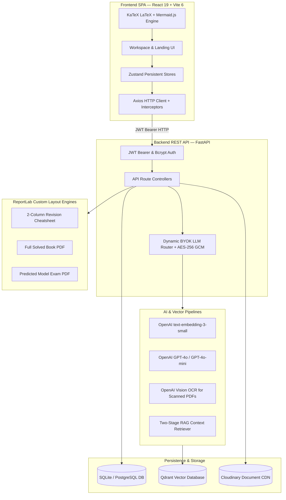

# 🎓 AcademicStack

> **Intelligent RAG-Grounded Exam Preparation, Blueprint Prediction & Peer Collaboration Platform for University Students**

[](https://fastapi.tiangolo.com/)
[](https://react.dev/)
[](https://tailwindcss.com/)
[](https://qdrant.tech/)
[](https://openai.com/)
[](LICENSE)

---

### 🔗 Quick Links & Repositories

| Resource | Link | Description |
| :--- | :--- | :--- |
| 🌐 **Live Application** | [academicstack.kshoeb.in](https://academicstack.kshoeb.in) | Production deployment of the full web application |
| 🎨 **Frontend Repository** | [github.com/kshxaib/as-frontend](https://github.com/kshxaib/as-frontend) | React 19, Vite 6, TailwindCSS v4, KaTeX & Zustand SPA |
| ⚙️ **Backend Repository** | [github.com/kshxaib/as-backend](https://github.com/kshxaib/as-backend) | FastAPI, Qdrant Vector Store, Two-Stage RAG & PDF Engines |
| 📖 **Master Technical Docs** | [PROJECT_DOCUMENTATION.md](PROJECT_DOCUMENTATION.md) | Full architectural blueprint, DB schemas & API contracts |

---

## 🌟 Overview

**AcademicStack** is an end-to-end AI study revision and exam preparation platform designed for university students, study groups, and academic batches. 

Instead of manually spending weeks searching for answers across hundreds of lecture slides and solving historical exam papers with generic, hallucination-prone AI prompts, AcademicStack provides:

1. **Strictly Grounded RAG Solutions**: Answers generated strictly from uploaded syllabus notes and lecture slides using dense vector search (`text-embedding-3-small` + Qdrant), eliminating AI hallucinations.
2. **Two-Stage Synthesis & Review Engine**: Drafts student-friendly explanations with **2-Minute Quick Recall** blocks, **KaTeX math formulas**, **Mermaid flowcharts**, and **marks-proportional length scaling**.
3. **Zero-Assumption Exam Paper Predictor**: Audits up to 10 years of historical question papers to extract exact examination blueprints, calculate module weights, and synthesize authentic high-probability model examination papers.
4. **1-Click PDF Export**: Generates full-length solved books, formal university exam question sheets, and ultra-compact **2-column examination revision cheatsheets** powered by ReportLab.
5. **The Commons (Community Hub)**: Discover peer-shared question banks, solved answer keys, and predicted papers with **1-click workspace cloning**.

---

## 🏗️ Architecture & Tech Stack



### Technology Highlights

| Component | Technology | Description |
| :--- | :--- | :--- |
| **Frontend SPA** | React 19, Vite 6, JavaScript | Fast, interactive single-page application with responsive workspace shell |
| **Styling** | TailwindCSS v4, CSS Custom Properties | Curated warm-paper academic design tokens with dark/light themes |
| **State Management**| Zustand v5 (Persisted) | Atomic, multi-store state synchronization with `localStorage` cache |
| **Math & Diagrams** | KaTeX, Mermaid.js v11, `react-markdown` | High-fidelity LaTeX math typography and vector flowcharts |
| **Backend API** | FastAPI, Python 3.11+, Uvicorn | High-performance asynchronous RESTful backend |
| **Database & ORM** | SQLite / PostgreSQL, SQLAlchemy ORM | Relational schema with cascade rules and foreign-key integrity |
| **Vector Database** | Qdrant Cloud / Local Collection | Dense vector indexing for chunked study materials |
| **LLM & Embeddings**| OpenAI GPT-4o / GPT-4o-mini / Vision | Grounded RAG synthesis, OCR transcription, and exam blueprint forecasting |
| **PDF Generation** | ReportLab 4.4+, PyMuPDF | Custom canvas geometry, DejaVu typography, and multi-column pagination |
| **Cloud Storage** | Cloudinary CDN | Secure raw PDF document storage and signed streaming delivery |
| **Security** | AES-256 GCM, PBKDF2 HMAC-SHA256, JWT | Client-side encrypted Bring-Your-Own-Key (BYOK) architecture |

---

## 📂 Project Directory Structure

```text
AcademicStack/
├── as-frontend/                            # Frontend Single Page Application
│   ├── public/                             # Static assets & favicon
│   ├── src/
│   │   ├── api/
│   │   │   └── client.js                   # Axios HTTP client with Bearer auth interceptors
│   │   ├── components/
│   │   │   ├── ui/                         # Reusable UI atoms (Logo, Badges, EmptyState, ThemeToggle)
│   │   │   ├── LandingPage.jsx             # Public marketing page with 3D perspective preview
│   │   │   ├── WorkspaceLayout.jsx         # Authenticated app shell with sidebar navigation
│   │   │   ├── ResourceManager.jsx         # Study notes/slides upload & vector indexing tab
│   │   │   ├── QuestionBankManager.jsx     # Past exam paper upload & AI extraction tab
│   │   │   ├── QuestionReview.jsx          # Parsed question review, mark editing & RAG trigger
│   │   │   ├── SolutionViewer.jsx          # Grounded solution viewer, KaTeX, Mermaid & PDF export
│   │   │   ├── PredictedPaperGenerator.jsx # AI Exam blueprint & model paper predictor
│   │   │   ├── CommunityHub.jsx            # The Commons discovery feed & 1-click cloning
│   │   │   ├── ProfileSettings.jsx         # Encrypted OpenAI BYOK configuration
│   │   │   └── ...                         # Dedicated viewers and modals
│   │   ├── store/
│   │   │   ├── useAuthStore.js             # User session, JWT tokens, profile state
│   │   │   ├── useQuestionBankStore.js     # Primary data store for resources, QBs, questions, answers
│   │   │   ├── usePracticeStore.js         # Practice mode and active answer visibility state
│   │   │   └── useThemeStore.js            # Light/Dark mode state
│   │   ├── App.jsx                         # Main app orchestrator & route coordinator
│   │   └── index.css                       # Design tokens, typography & KaTeX overrides
│   ├── package.json                        # Frontend NPM dependencies
│   └── vite.config.js                      # Vite build configuration
│
├── as-backend/                             # FastAPI Python REST Backend
│   ├── app/
│   │   ├── answers/                        # RAG solution synthesis, retry & cheatsheet endpoints
│   │   ├── community/                      # Public discovery, sharing & 1-click cloning endpoints
│   │   ├── core/                           # Security, JWT encoding/decoding, configuration
│   │   ├── db/                             # SQLAlchemy engine, session, and relational models
│   │   ├── indexing/                       # PDF text chunking, embedding generation & Qdrant upsert
│   │   ├── llm/                            # Dynamic BYOK router & OpenAI completion wrappers
│   │   ├── parsing/                        # Multi-pass GPT-4o question paper parser
│   │   ├── pdf/                            # ReportLab PDF layout engines (Solved, Cheatsheet, Exam)
│   │   ├── predictor/                      # Statistical pattern analysis & exam blueprint synthesizer
│   │   ├── question_banks/                 # Question bank CRUD, file ingestion & PDF export
│   │   ├── questions/                      # Question CRUD & mark modification endpoints
│   │   ├── rag/                            # Vector embeddings, retriever & 2-stage generation
│   │   ├── resources/                      # Study resource upload, listing & Cloudinary storage
│   │   ├── storage/                        # Cloudinary document storage connector
│   │   ├── users/                          # User authentication, registration & AES key encryption
│   │   ├── utils/                          # AES-256 GCM encryption & error formatting
│   │   ├── vector_store/                   # Qdrant client & collection initialization
│   │   └── main.py                         # FastAPI application entrypoint & CORS middleware
│   ├── Dockerfile                          # Backend containerization Dockerfile
│   ├── docker-compose.yml                  # Full stack local orchestration
│   └── requirements.txt                    # Backend Python dependencies
│
├── PROJECT_DOCUMENTATION.md                # Comprehensive Project Specification & Source of Truth
└── README.md                               # Project Overview & Quickstart Guide
```

---

## ⚡ Quick Start Guide

### Prerequisites
- **Node.js**: v18.0.0 or higher & `npm`
- **Python**: v3.11 or higher
- **OpenAI API Key** (or input your personal key via the app UI in Profile Settings)
- **Qdrant**: Cloud cluster URL/Key or local instance (`localhost:6333`)
- **Cloudinary Account**: Cloud Name, API Key, API Secret

---

### 1. Backend Setup

```bash
# 1. Navigate to backend directory
cd as-backend

# 2. Create and activate a Python virtual environment
python -m venv venv

# On Windows (PowerShell):
.\venv\Scripts\Activate.ps1
# On macOS / Linux:
source venv/bin/activate

# 3. Install Python dependencies
pip install -r requirements.txt

# 4. Configure environment variables
cp .env.example .env
# Edit .env with your credentials (DATABASE_URL, SECRET_KEY, CLOUDINARY_*, QDRANT_*)

# 5. Start the FastAPI development server
uvicorn app.main:app --reload --host 127.0.0.1 --port 8000
```
Backend API interactive documentation is available at `http://127.0.0.1:8000/docs`.

---

### 2. Frontend Setup

```bash
# 1. In a separate terminal, navigate to frontend directory
cd as-frontend

# 2. Install Node dependencies
npm install

# 3. Start the Vite development server
npm run dev
```

The frontend application will boot at **`http://localhost:5173`**.

---

### 3. Docker Compose Setup (Alternative)

To run the entire system via Docker:

```bash
# Inside as-backend/
docker-compose up --build
```

---

## 🔑 Environment Variables Reference

### Backend (`as-backend/.env`)

```env
APP_NAME=AcademicStack
DEBUG=True
DATABASE_URL=sqlite:///./academicstack.db
SECRET_KEY=your_secure_random_jwt_secret_key_here
OPENAI_API_KEY=sk-proj-your_fallback_openai_key_here

# Cloudinary Storage
CLOUDINARY_CLOUD_NAME=your_cloud_name
CLOUDINARY_API_KEY=your_api_key
CLOUDINARY_API_SECRET=your_api_secret

# Qdrant Vector Store
QDRANT_HOST=https://your-qdrant-cluster.qdrant.tech
QDRANT_API_KEY=your_qdrant_api_key

# CORS Whitelist (Comma-separated)
FRONTEND_URL=http://localhost:5173,http://127.0.0.1:5173
```

### Frontend (`as-frontend/.env`)

```env
VITE_API_URL=http://127.0.0.1:8000/api
```

---

## 📡 Core API Endpoints

| Category | Method | Endpoint | Description |
| :--- | :---: | :--- | :--- |
| **Auth** | `POST` | `/api/auth/register` | Register new student account |
| **Auth** | `POST` | `/api/auth/login` | Authenticate student & receive Bearer JWT |
| **Auth** | `GET` | `/api/auth/me` | Fetch active profile & key status |
| **Profile** | `PUT` | `/api/auth/profile/openai-key` | Save encrypted personal OpenAI key (AES-256) |
| **Resources**| `POST` | `/api/resources` | Upload study notes/slides PDF to Cloudinary |
| **Resources**| `POST` | `/api/resources/{id}/index` | Chunk & embed study material into Qdrant |
| **Question Banks** | `POST` | `/api/question-banks` | Upload past exam paper PDF |
| **Question Banks** | `POST` | `/api/question-banks/{id}/extract` | AI question extraction via GPT-4o |
| **Answers** | `POST` | `/api/answer-sets/generate` | Generate grounded solutions via RAG |
| **Answers** | `GET` | `/api/answer-sets/{id}/pdf` | Download full Solved Book PDF |
| **Answers** | `GET` | `/api/answer-sets/{id}/cheatsheet-pdf` | Download 2-column compact Cheatsheet PDF |
| **Answers** | `POST` | `/api/answers/{id}/retry` | Re-solve single question with custom feedback |
| **Predictor** | `POST` | `/api/predictor/generate` | Synthesize predicted exam paper blueprint |
| **Predictor** | `POST` | `/api/predictor/pdf` | Export authentic university examination sheet PDF |
| **Predictor** | `POST` | `/api/predictor/save-as-qb` | Clone predicted paper into editable Question Bank |
| **Community** | `GET` | `/api/community/resources` | Discover shared study materials in The Commons |
| **Community** | `GET` | `/api/community/answer-sets` | Discover shared solved answer sets |
| **Community** | `POST` | `/api/community/.../clone` | 1-Click clone shared assets into private workspace |

For the complete endpoint specifications, see [PROJECT_DOCUMENTATION.md](file:///d:/Shoaib/AcademicStack/PROJECT_DOCUMENTATION.md).

---

## 📖 Complete Documentation

For comprehensive architecture details, database entity-relationship schemas, RAG prompt engineering specifications, and token design standards, refer to the source of truth document:

👉 **[PROJECT_DOCUMENTATION.md](file:///d:/Shoaib/AcademicStack/PROJECT_DOCUMENTATION.md)**

---

## 📄 License

This project is licensed under the MIT License — see the [LICENSE](LICENSE) file for details.
