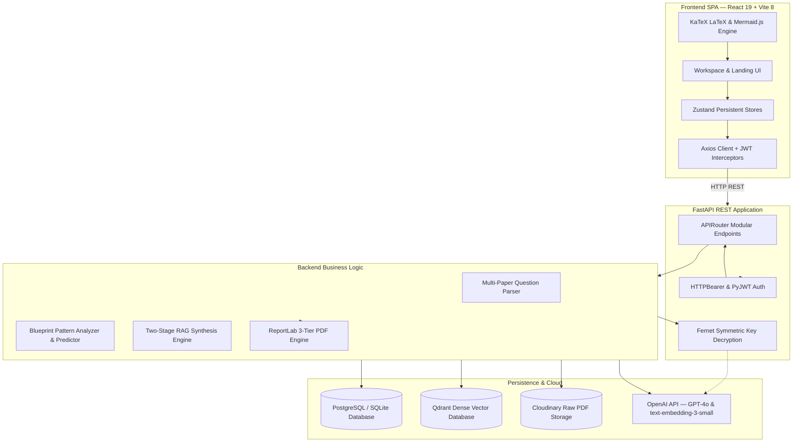

# 📚 AcademicStack Documentation Suite

Welcome to the official, verified technical documentation suite for **AcademicStack** — the intelligent AI exam preparation, blueprint prediction, and study resource collaboration platform for university students.

This documentation suite is strictly grounded in the physical codebase of AcademicStack (`as-backend` and `as-frontend`), with zero speculative or imaginary features.

---

## 🗺️ Master Table of Contents & Sitemap

| Section | Document | Target Audience | Key Contents |
| :--- | :--- | :--- | :--- |
| **00** | [Master Index](file:///d:/Shoaib/AcademicStack/docs/README.md) | Everyone | Sitemap, Persona Reading Paths, High-Level Architecture Topology |
| **01** | [Project Overview](file:///d:/Shoaib/AcademicStack/docs/01-project-overview.md) | Leadership & Product | Mission, Academic Problems Solved, Verified Feature Pillars, Constraints |
| **02** | [Architecture & Dataflow](file:///d:/Shoaib/AcademicStack/docs/02-architecture-and-dataflow.md) | Architects & Senior Devs | System Topology, End-to-End Request Lifecycles, 5-Step Academic Workflow |
| **03** | [Backend Architecture](file:///d:/Shoaib/AcademicStack/docs/03-backend-architecture.md) | Backend & AI Engineers | FastAPI Modular Layout, Service Patterns, LLM Routing, Exception Handling |
| **04** | [Frontend Architecture](file:///d:/Shoaib/AcademicStack/docs/04-frontend-architecture.md) | Frontend Engineers | React 19, Vite, Zustand Stores, KaTeX/Mermaid Rendering, Design Tokens |
| **05** | [API Documentation](file:///d:/Shoaib/AcademicStack/docs/05-api-documentation.md) | API Consumers & Integrators | 34 REST Endpoints, HTTP Verbs, Payloads, Response Schemas, Error Codes |
| **06** | [Database & Storage](file:///d:/Shoaib/AcademicStack/docs/06-database-and-storage.md) | DBAs & Cloud Engineers | SQLAlchemy Relational Models, ER Diagrams, Qdrant Vectors, Cloudinary CDN |
| **07** | [Core Features & Logic](file:///d:/Shoaib/AcademicStack/docs/07-core-features-and-logic.md) | AI Engineers & Researchers | Two-Stage RAG Pipeline, Blueprint Audit Predictor, ReportLab PDF Engines |
| **08** | [Setup & Deployment](file:///d:/Shoaib/AcademicStack/docs/08-setup-and-deployment.md) | DevOps & Developers | Local Runbook, Environment Variable Specs, Docker Compose, Production |

---

## 🧭 Persona-Based Reading Paths

Depending on your role and objectives, follow these curated reading paths:

### 1. 🏗️ Software Architects & Technical Leads
1. Start with [01-project-overview.md](file:///d:/Shoaib/AcademicStack/docs/01-project-overview.md) to understand business objectives and architectural principles.
2. Review [02-architecture-and-dataflow.md](file:///d:/Shoaib/AcademicStack/docs/02-architecture-and-dataflow.md) for system boundaries and data transformation paths.
3. Review [06-database-and-storage.md](file:///d:/Shoaib/AcademicStack/docs/06-database-and-storage.md) for data isolation and storage tier designs.
4. Deep dive into [07-core-features-and-logic.md](file:///d:/Shoaib/AcademicStack/docs/07-core-features-and-logic.md) for AI and PDF engine specifications.

### 2. 💻 Full-Stack & Backend Developers
1. Review [03-backend-architecture.md](file:///d:/Shoaib/AcademicStack/docs/03-backend-architecture.md) to understand FastAPI routers, dependencies, and services.
2. Refer to [05-api-documentation.md](file:///d:/Shoaib/AcademicStack/docs/05-api-documentation.md) for full request/response schemas.
3. Follow [08-setup-and-deployment.md](file:///d:/Shoaib/AcademicStack/docs/08-setup-and-deployment.md) for local environment bootstrapping.

### 3. 🎨 Frontend & UI/UX Engineers
1. Read [04-frontend-architecture.md](file:///d:/Shoaib/AcademicStack/docs/04-frontend-architecture.md) for Zustand store designs, component hierarchies, and rendering.
2. Refer to [05-api-documentation.md](file:///d:/Shoaib/AcademicStack/docs/05-api-documentation.md) for backend contracts.
3. Check the typography and styling tokens in [04-frontend-architecture.md#design-tokens--typography](file:///d:/Shoaib/AcademicStack/docs/04-frontend-architecture.md).

### 4. 🚀 DevOps & System Administrators
1. Go directly to [08-setup-and-deployment.md](file:///d:/Shoaib/AcademicStack/docs/08-setup-and-deployment.md) for Docker, environment variables, and cloud runbooks.
2. Inspect [06-database-and-storage.md](file:///d:/Shoaib/AcademicStack/docs/06-database-and-storage.md) for PostgreSQL schema initialization and Qdrant collections.

---

## 🏛️ High-Level System Architecture

```mermaid
flowchart TB
    subgraph Client [Frontend SPA — React 19 + Vite 8]
        UI[Workspace & Landing UI]
        Stores[Zustand Persistent Stores]
        MathEngine[KaTeX LaTeX & Mermaid.js Engine]
        AxiosClient[Axios Client + JWT Interceptors]
    end

    subgraph Gateway [FastAPI REST Application]
        Router[APIRouter Modular Endpoints]
        Security[HTTPBearer & PyJWT Auth]
        Crypt[Fernet Symmetric Key Decryption]
    end

    subgraph CoreServices [Backend Business Logic]
        ParserService[Multi-Paper Question Parser]
        PredictorService[Blueprint Pattern Analyzer & Predictor]
        RAGService[Two-Stage RAG Synthesis Engine]
        PDFService[ReportLab 3-Tier PDF Engine]
    end

    subgraph ExternalStorage [Persistence & Cloud]
        DB[(PostgreSQL / SQLite Database)]
        Qdrant[(Qdrant Dense Vector Database)]
        Cloudinary[(Cloudinary Raw PDF Storage)]
        OpenAI[OpenAI API — GPT-4o & text-embedding-3-small]
    end

    UI --> Stores
    Stores --> AxiosClient
    MathEngine --> UI
    AxiosClient -- HTTP REST --> Gateway
    Gateway --> Security
    Security --> Router
    Router --> CoreServices
    CoreServices --> Crypt
    Crypt -.-> OpenAI
    CoreServices --> DB
    CoreServices --> Qdrant
    CoreServices --> Cloudinary
    CoreServices --> OpenAI
    CoreServices --> PDFService
```

---

## 🛡️ Grounding & Verification Notice

This documentation suite has been verified against the physical source code located in:
- Backend: [as-backend/](file:///d:/Shoaib/AcademicStack/as-backend/)
- Frontend: [as-frontend/](file:///d:/Shoaib/AcademicStack/as-frontend/)

All endpoints, class names, functions, and configuration parameters match real implementations in the repository.
