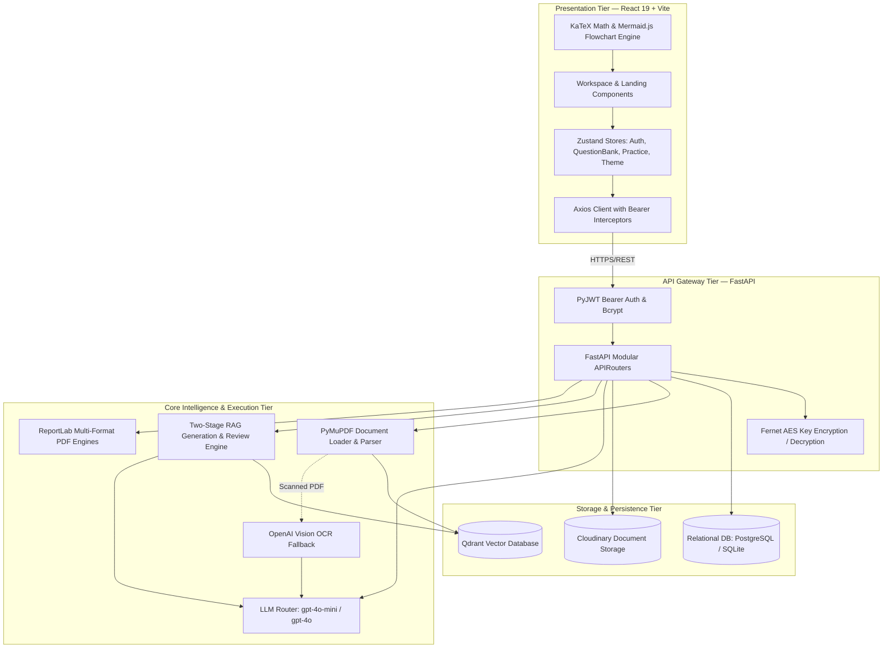
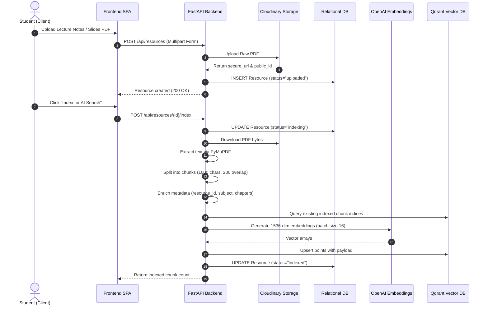
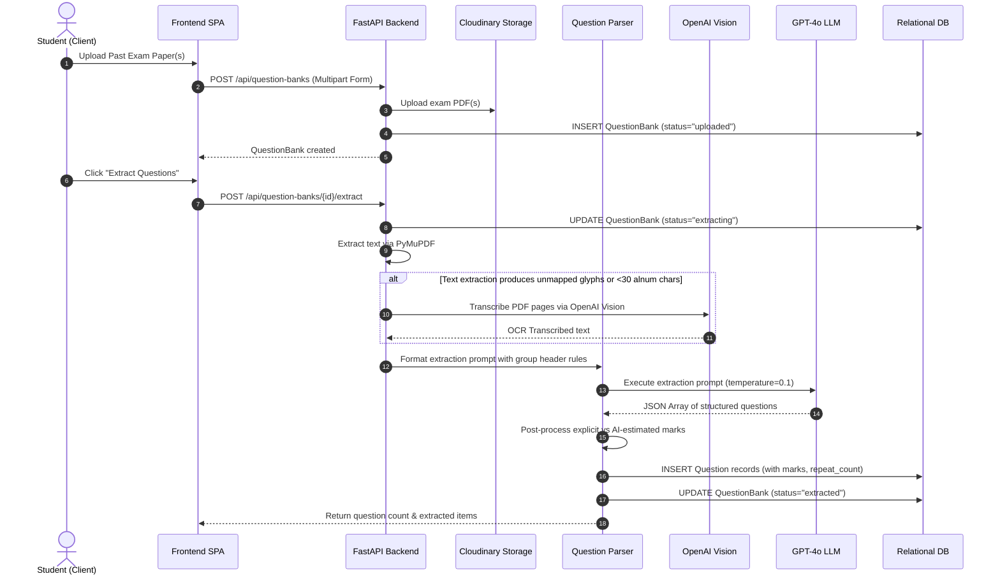
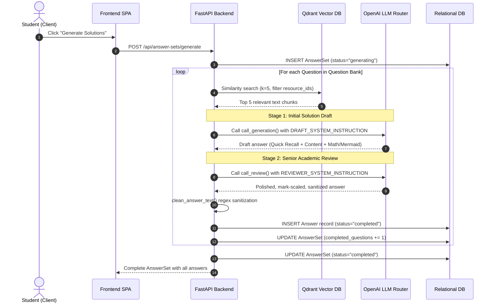
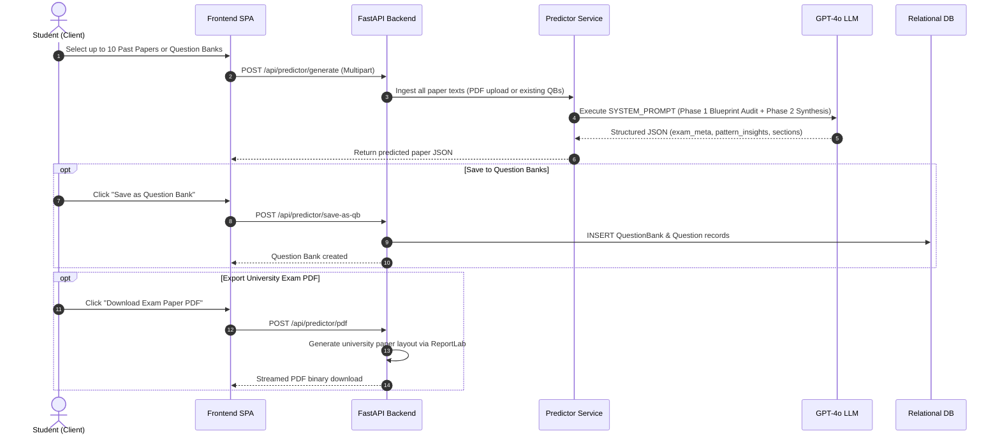

# 02. Architecture & Dataflow

## 🏛️ System Topology & Architectural Layers

AcademicStack is structured across four primary layers:
1. **Presentation Layer (SPA Client):** Single Page Application built with React 19, Vite, and Zustand.
2. **API & Orchestration Layer (REST Gateway):** Asynchronous FastAPI application managing security, parsing, and pipelines.
3. **Core Intelligence & Rendering Layer:** LangChain RAG pipeline, OpenAI GPT-4o synthesis, and ReportLab PDF layout engines.
4. **Data & Persistence Layer:** PostgreSQL / SQLite relational database, Qdrant vector store, and Cloudinary CDN storage.



---

## 🔄 End-to-End User Lifecycles & Lifecycles

### 1. Study Resource Upload & Vector Indexing Lifecycle



---

### 2. Question Bank Upload & Multi-Paper Extraction Lifecycle



---

### 3. Two-Stage Grounded RAG Solution Synthesis Lifecycle



---

### 4. Zero-Assumption Exam Blueprint Prediction Lifecycle



---

## 📊 Data Transformation Pipelines

### 1. Document to Vector Representation Pipeline
```
[Raw PDF File]
       │
       ▼ PyMuPDFLoader
[Document(page_content, page_number)]
       │
       ▼ RecursiveCharacterTextSplitter (chunk_size=1000, overlap=200)
[Text Chunks]
       │
       ▼ enrich_documents()
[Document with metadata: resource_id, subject, chapter, chunk_index]
       │
       ▼ OpenAI text-embedding-3-small
[1536-Dimensional Floating Point Vector]
       │
       ▼ Qdrant client.upsert() with COSINE distance
[Qdrant Collection: academicstack_resources_openai]
```

### 2. Multi-Paper Exam Paper to Question Record Pipeline
```
[Past Paper PDF / Scanned PDF]
       │
       ├─► PyMuPDF fitz.get_text() (if readable)
       └─► PyMuPDF pixmap render ──► OpenAI Vision (OCR Fallback)
       │
       ▼ Combined Clean Exam Text
       │
       ▼ GPT-4o Extraction Prompt (temperature=0.1)
[Raw JSON Array: question_number, question_text, marks, marks_source]
       │
       ▼ _clean_and_estimate_marks()
       ├─► Explicit Marks: Group header inheritance (e.g. Q.1 for 2 Marks)
       └─► AI Estimated Marks: Standard tiers (2, 5, 10) based on complexity
       │
       ▼ SQLAlchemy ORM
[Question Table Records: question_bank_id, marks, marks_source, repeat_count]
```

### 3. Grounded Answer to Multi-Format Export Pipeline
```
[Question + Top 5 Study Chunks]
       │
       ▼ Stage 1: Draft Generation (call_generation)
[Draft Answer with Quick Recall & Rough LaTeX/Mermaid]
       │
       ▼ Stage 2: Senior Reviewer (call_review)
[Refined, mark-scaled explanation strictly matching marks]
       │
       ▼ clean_answer_text() regex sanitization
[Stored in answers.content]
       │
       ├─► Frontend Client: KaTeX math + Mermaid.js vector rendering
       ├─► Solved Book PDF: ReportLab DejaVu Serif + mathrender PNGs
       └─► 2-Column Cheatsheet: ReportLab compact multi-column canvas
```
