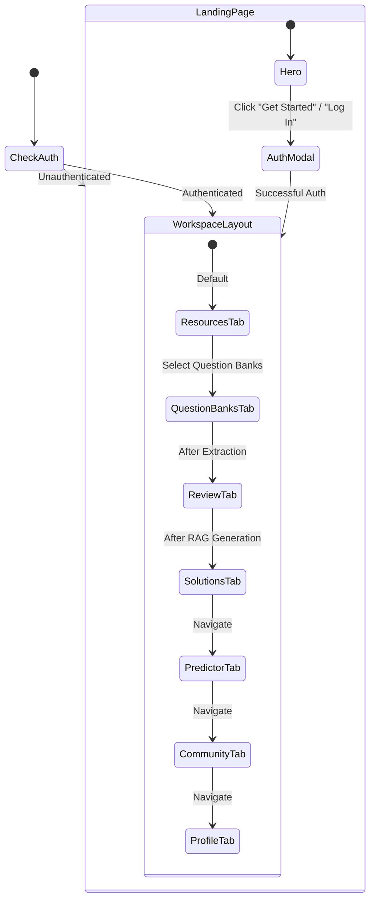

# 04. Frontend Architecture

## 🎨 UI Tech Stack & Bundler Configuration

The frontend of AcademicStack is a Single-Page Application (SPA) designed for rapid interaction, zero page reloads, and mathematical typography:

- **Core Library:** [React](https://react.dev/) `19.2.8` with `react-dom` `19.2.8`
- **Build Tool & Dev Server:** [Vite](https://vitejs.dev/) `8.2.0` with `@vitejs/plugin-react` `6.0.4`
- **CSS Engine:** [TailwindCSS](https://tailwindcss.com/) `4.3.3` with `@tailwindcss/vite` plugin
- **State Management:** [Zustand](https://github.com/pmndrs/zustand) `5.0.15` with `persist` middleware
- **HTTP Client:** [Axios](https://axios-http.com/) `1.19.0` with Bearer request interceptors
- **Mathematical Typography:** [KaTeX](https://katex.org/) `0.18.4`, `rehype-katex` `7.0.1`, `remark-math` `6.0.0`
- **Markdown & Diagram Parsing:** `react-markdown` `10.1.0`, `remark-gfm` `4.0.1`, [Mermaid.js](https://mermaid.js.org/) `11.17.2`
- **Icons & Micro-Animations:** [Lucide React](https://lucide.dev/) `1.33.0` and [Motion](https://motion.dev/) `13.1.1`

---

## 📂 Verified Physical Directory Structure

Every single file in this tree physically exists in the repository under [as-frontend/src/](file:///d:/Shoaib/AcademicStack/as-frontend/src/):

```text
as-frontend/src/
├── api/
│   └── client.js                       # Axios instance with baseURL & JWT Bearer token interceptor
├── components/
│   ├── ui/
│   │   ├── AcademicLogo.jsx            # Platform emblem and brand typography
│   │   ├── ApiKeyBanner.jsx            # Persistent warning banner when OpenAI BYOK key is missing
│   │   ├── EmptyState.jsx              # Reusable zero-data illustration & call-to-action
│   │   ├── GithubIcon.jsx              # GitHub brand icon component
│   │   ├── StatusBadge.jsx             # Color-coded badge for resource and answer statuses
│   │   └── ThemeToggle.jsx             # Theme switch atom
│   ├── AddQuestionModal.jsx            # Modal to manually insert new questions into a Question Bank
│   ├── AiProgressModal.jsx             # Real-time multi-stage AI progress tracker modal
│   ├── AnswerCard.jsx                  # Individual answer card with Quick Recall, KaTeX, and Retry
│   ├── ApiKeyRequiredModal.jsx         # Intercept modal prompting student to input OpenAI key
│   ├── AuthModal.jsx                   # Tabbed Login & Registration dialog
│   ├── CommunityAnswerViewer.jsx       # Modal reading interface for peer-shared solved answer sets
│   ├── CommunityHub.jsx                # The Commons: public discovery grid & 1-click cloning
│   ├── CommunityPredictedPaperViewer.jsx # Modal reading interface for peer-shared predicted papers
│   ├── CommunityQuestionBankViewer.jsx # Modal reading interface for peer-shared question banks
│   ├── ConfirmationModal.jsx           # Generic confirmation modal for destructive operations
│   ├── ErrorModal.jsx                  # Global error alert dialog with user-friendly error formatting
│   ├── LandingPage.jsx                 # Public landing page with features, 3D perspective & hero preview
│   ├── MermaidDiagram.jsx              # Dynamic SVG renderer for Mermaid flowcharts and architectures
│   ├── Navbar.jsx                      # Top navigation bar with logo, profile trigger, and status
│   ├── PredictedPaperGenerator.jsx     # Multi-paper upload, blueprint audit, and prediction studio
│   ├── ProfileSettings.jsx             # Student profile settings and encrypted OpenAI key management
│   ├── QuestionBankManager.jsx         # Exam paper upload, question bank list, and extraction view
│   ├── QuestionCard.jsx                # Editable question card in the review screen
│   ├── QuestionReview.jsx              # Post-extraction question review, marks adjustment & RAG trigger
│   ├── ResourceManager.jsx             # Lecture slides / notes upload and vector indexing manager
│   ├── SolutionViewer.jsx              # Grounded answers viewer, flashcard mode & PDF export bar
│   └── WorkspaceLayout.jsx             # Primary authenticated shell with sidebar and content area
├── store/
│   ├── useAuthStore.js                 # Authentication state, JWT tokens, and profile session
│   ├── usePracticeStore.js             # Persisted flashcard test mode, answer reveal, and mastery tracking
│   ├── useQuestionBankStore.js         # Primary orchestrator store: QBs, resources, answers, community
│   └── useThemeStore.js                # Theme controller and DOM attribute sync
├── App.jsx                             # Application root: tab routing, auth guards & share-link detection
├── index.css                           # Academic paper design tokens, fonts, and KaTeX overrides
└── main.jsx                            # React 19 root DOM mount entrypoint
```

---

## 🗄️ State Management Architecture (Zustand)

State is organized into four atomic Zustand stores:

### 1. `useAuthStore.js` — Authentication & BYOK Session
- **Storage:** Persists `access_token` under the `localStorage` key `academicstack_token`.
- **State Fields:** `user` (id, username, name, has_openai_key), `token`, `isAuthenticated`, `isLoading`, `error`, `isAuthModalOpen`, `authModalMode` (`login` | `register`).
- **Core Actions:**
  - `initAuth()`: Invokes `GET /api/auth/me` on startup; purges invalid tokens on 401.
  - `login(username, password)`: Calls `POST /api/auth/login`, saves JWT to `localStorage`.
  - `register(username, password, name)`: Calls `POST /api/auth/register`, initializes session.
  - `logout()`: Purges `localStorage` token, resets user state, and displays logout toast.
  - `updateOpenAIKey(key)`: Submits personal key to `PUT /api/auth/profile/openai-key`.
  - `deleteOpenAIKey()`: Purges personal key via `DELETE /api/auth/profile/openai-key`.

### 2. `useQuestionBankStore.js` — Domain Data & Workspace Orchestration
- **Navigation State:** `activeTab` (`resources`, `question_banks`, `review`, `solutions`, `predictor`, `community`, `profile`).
- **Study Resources State:** `resources` array, `isUploadingResource`, `isIndexingResource` (map of resource IDs to boolean status).
- **Question Banks State:** `questionBanks` array, `currentQuestionBank`, `questions` array, `extractingQBs` (map), `extractionFailedQB`.
- **Answers State:** `currentAnswerSet`, `answerSetsList`, `isGeneratingAnswers`, `isRetryingAnswer` (map of answer IDs to boolean status).
- **The Commons State:** `communityResources`, `communityAnswerSets`, `communityPredictedPapers`, `communityQuestionBanks`, viewer modal states, and cloning flags.
- **Key Guards:** `hasAllRequiredKeys()` and `hasEmbeddingKey()` check if the active student has saved their OpenAI API key before executing AI operations.

### 3. `usePracticeStore.js` — Flashcard Test Mode & Mastery Tracking
- **Persistence:** Persisted to `localStorage` under `academicstack_practice_store`.
- **State Fields:**
  - `isTestMode`: Boolean toggling flashcard mode in the Solution Viewer.
  - `masteryMap`: Map of answer IDs to status (`NEEDS_REVIEW` | `MASTERED`).
  - `revealedMap`: In-memory map of answer IDs to boolean visibility (blur vs reveal).
- **Core Actions:**
  - `toggleTestMode()`: Switches between normal solution reading and flashcard exam mode.
  - `setMastery(answerId, status)`: Sets mastery level for a solved question.
  - `revealAnswer(id)` / `hideAnswer(id)`: Controls interactive solution unblurring.
  - `revealAll(ids)` / `hideAll(ids)`: Batch toggles solution visibility.

### 4. `useThemeStore.js` — Theme Management
- **Theme State:** Sets data-theme attribute on `document.documentElement`.
- **Active Behavior:** Configured with AcademicStack dark/warm tokens.

---

## 🧭 Navigation & Tab Routing Design

AcademicStack intentionally avoids complex multi-page routing libraries in favor of a fast, state-driven tab architecture inside [App.jsx](file:///d:/Shoaib/AcademicStack/as-frontend/src/App.jsx):



### URL Share-Token Interception
When an unauthenticated or authenticated user accesses a shared predicted paper link:
`https://academicstack.kshoeb.in/?predict=p_XYZ123`
[App.jsx](file:///d:/Shoaib/AcademicStack/as-frontend/src/App.jsx) reads `window.location.search`, extracts the `predict` parameter, passes it directly to `<PredictedPaperGenerator sharedToken={sharedPredictToken} />`, and provides a 1-click workspace view.

---

## 📐 Math, Diagram & Content Rendering Pipeline

### 1. KaTeX Mathematical Typography
Solved answers frequently contain complex university-level mathematics (discrete sets, calculus, probability distributions, fuzzy logic matrices). Rendering is handled inside [AnswerCard.jsx](file:///d:/Shoaib/AcademicStack/as-frontend/src/components/AnswerCard.jsx) using:
```jsx
<ReactMarkdown
  remarkPlugins={[remarkMath, remarkGfm]}
  rehypePlugins={[rehypeKatex]}
>
  {answerContent}
</ReactMarkdown>
```
KaTeX CSS is imported at the top of [index.css](file:///d:/Shoaib/AcademicStack/as-frontend/src/index.css) to guarantee crisp rendering without font shifts.

### 2. Mermaid.js Flowchart & Diagram Engine
When an answer or predicted paper contains an architecture or workflow diagram, it is output as a fenced code block with language `mermaid`.
[MermaidDiagram.jsx](file:///d:/Shoaib/AcademicStack/as-frontend/src/components/MermaidDiagram.jsx):
- Dynamically initializes `mermaid.initialize({ startOnLoad: false, theme: 'neutral' })`.
- Assigns a unique DOM ID to avoid collisions.
- Calls `mermaid.render()` and injects the resulting vector SVG into a clean, zoomable container.
- Gracefully catches syntax errors and displays a fallback code view if rendering fails.

---

## 🎨 Design Tokens & Typography

The design system uses a curated academic palette defined in [index.css](file:///d:/Shoaib/AcademicStack/as-frontend/src/index.css):

| Token Category | Variable Name | Value | Purpose |
| :--- | :--- | :--- | :--- |
| **Display Font** | `--font-display` | `'Fraunces', Georgia, serif` | Editorial headings and brand titles |
| **Sans Font** | `--font-sans` | `'Geist', system-ui, sans-serif` | Clean body text and workspace UI |
| **Mono Font** | `--font-mono` | `'JetBrains Mono', monospace` | Code blocks, formulas, marks badges |
| **Background** | `--background` | `#F8F7F4` | Warm academic paper ivory |
| **Primary Text** | `--text-primary` | `#19243B` | Deep academic ink |
| **Muted Text** | `--text-muted` | `#687184` | Subtle captions and metadata |
| **Primary Accent** | `--primary` | `#0057FF` | High-contrast university cobalt |
| **Border Tone** | `--border` | `#E2E0D9` | Warm paper separator rule |
| **Success / Done** | `--success` | `#187347` | Completed answers & indexed badges |
| **Warning / Caution**| `--warning` | `#B54708` | Retry required or quota notices |
| **Error / Failed** | `--error` | `#B42318` | Extraction failure or server errors |
