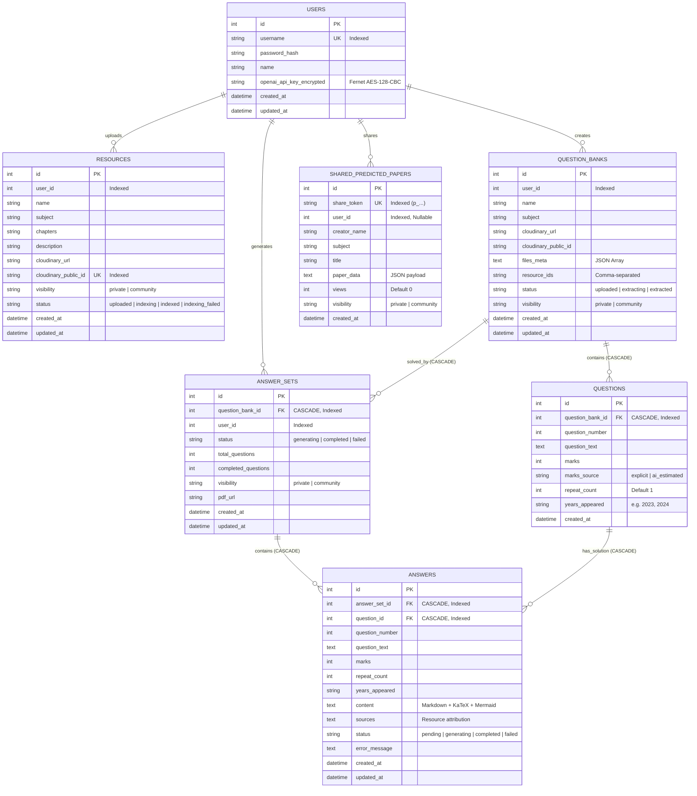

# 06. Database & Storage Architecture

## 🗄️ Relational Database Architecture

AcademicStack employs [SQLAlchemy](file:///d:/Shoaib/AcademicStack/as-backend/app/db/database.py) ORM with a relational database backend (PostgreSQL in production, SQLite supported in local testing). Connection pooling is configured with `pool_pre_ping=True` to eliminate stale connections across long-running AI synthesis tasks.

### Entity-Relationship (ER) Diagram



---

## 📋 Table Definitions & Constraints

### 1. `users` Table
Stores authenticated student identities and encrypted personal API keys.
- `id` (Integer, Primary Key, Indexed)
- `username` (VARCHAR(100), Unique, Indexed, Not Null)
- `password_hash` (VARCHAR(255), Not Null): Bcrypt hashed password.
- `name` (VARCHAR(100), Not Null): Student's display name.
- `openai_api_key_encrypted` (VARCHAR, Nullable): Server-side encrypted OpenAI API key via Fernet.
- `created_at`, `updated_at` (DateTime, Default UTC)

### 2. `resources` Table
Represents uploaded syllabus materials, lecture slides, and notes.
- `id` (Integer, Primary Key, Indexed)
- `user_id` (Integer, Not Null, Indexed): Creator student ID.
- `name` (VARCHAR(200), Not Null): Document display title.
- `subject` (VARCHAR(100), Not Null): Course / subject name.
- `chapters` (VARCHAR, Nullable): Chapter or module tags.
- `description` (VARCHAR(1000), Nullable): Summary description.
- `cloudinary_url` (VARCHAR, Not Null): CDN download endpoint.
- `cloudinary_public_id` (VARCHAR, Unique, Indexed, Not Null): Cloudinary asset key.
- `visibility` (VARCHAR(20), Not Null, Default `"private"`): `"private"` | `"community"`.
- `status` (VARCHAR(20), Not Null, Default `"uploaded"`): `"uploaded"` | `"indexing"` | `"indexed"` | `"indexing_failed"`.
- `created_at`, `updated_at` (DateTime, Default UTC)

### 3. `question_banks` Table
Represents historical university examination papers uploaded for analysis.
- `id` (Integer, Primary Key, Indexed)
- `user_id` (Integer, Not Null, Indexed)
- `name` (VARCHAR(200), Not Null): e.g. "December 2024 Final Examination"
- `subject` (VARCHAR(100), Not Null)
- `cloudinary_url` (VARCHAR, Not Null)
- `cloudinary_public_id` (VARCHAR, Not Null)
- `files_meta` (Text, Nullable): JSON metadata array supporting multi-paper ingestion.
- `resource_ids` (VARCHAR, Not Null): Comma-separated resource IDs to ground against.
- `status` (VARCHAR(20), Not Null, Default `"uploaded"`): `"uploaded"` | `"extracting"` | `"extracted"`.
- `visibility` (VARCHAR(20), Not Null, Default `"private"`)
- `created_at`, `updated_at` (DateTime, Default UTC)

### 4. `questions` Table
Contains individual structured questions extracted from Question Banks.
- `id` (Integer, Primary Key, Indexed)
- `question_bank_id` (Integer, ForeignKey `question_banks.id`, `ondelete="CASCADE"`, Indexed)
- `question_number` (Integer, Not Null): Ordering within the paper.
- `question_text` (Text, Not Null): Full question statement.
- `marks` (Integer, Not Null): Numerical marks assigned to the question.
- `marks_source` (VARCHAR(20), Not Null, Default `"ai_estimated"`): `"explicit"` | `"ai_estimated"`.
- `repeat_count` (Integer, Not Null, Default 1): Frequency across historical papers.
- `years_appeared` (VARCHAR, Nullable): Comma-separated exam sessions (e.g. "May 2023, Dec 2024").
- `created_at` (DateTime, Default UTC)

### 5. `answer_sets` Table
Tracks solution generation sessions for an entire Question Bank.
- `id` (Integer, Primary Key, Indexed)
- `question_bank_id` (Integer, ForeignKey `question_banks.id`, `ondelete="CASCADE"`, Indexed)
- `user_id` (Integer, Not Null, Indexed)
- `status` (VARCHAR(50), Not Null, Default `"generating"`): `"generating"` | `"completed"` | `"failed"`.
- `total_questions` (Integer, Not Null, Default 0)
- `completed_questions` (Integer, Not Null, Default 0)
- `visibility` (VARCHAR(20), Not Null, Default `"private"`)
- `pdf_url` (VARCHAR, Nullable)
- `created_at`, `updated_at` (DateTime, Default UTC)

### 6. `answers` Table
Contains verified step-by-step solutions for individual questions.
- `id` (Integer, Primary Key, Indexed)
- `answer_set_id` (Integer, ForeignKey `answer_sets.id`, `ondelete="CASCADE"`, Indexed)
- `question_id` (Integer, ForeignKey `questions.id`, `ondelete="CASCADE"`, Indexed)
- `question_number` (Integer, Not Null)
- `question_text` (Text, Not Null)
- `marks` (Integer, Not Null)
- `repeat_count` (Integer, Not Null, Default 1)
- `years_appeared` (VARCHAR, Nullable)
- `content` (Text, Nullable): Markdown solution containing KaTeX and Mermaid diagrams.
- `sources` (Text, Nullable): Attribution metadata string.
- `status` (VARCHAR(50), Not Null, Default `"pending"`): `"pending"` | `"generating"` | `"completed"` | `"failed"`.
- `error_message` (Text, Nullable)
- `created_at`, `updated_at` (DateTime, Default UTC)

### 7. `shared_predicted_papers` Table
Stores published AI-predicted model exam papers for public access and cloning.
- `id` (Integer, Primary Key, Indexed)
- `share_token` (VARCHAR(64), Unique, Indexed, Not Null): Public URL token `p_<token>`.
- `user_id` (Integer, Nullable, Indexed): Nullable for anonymous sharing.
- `creator_name` (VARCHAR(100), Not Null, Default `"Student Scholar"`)
- `subject` (VARCHAR(100), Not Null)
- `title` (VARCHAR(200), Not Null)
- `paper_data` (Text, Not Null): Complete JSON payload of predicted blueprint and questions.
- `views` (Integer, Not Null, Default 0): View counter.
- `visibility` (VARCHAR(20), Not Null, Default `"private"`): `"private"` | `"community"`.
- `created_at` (DateTime, Default UTC)

---

## ⚡ Vector Store Architecture (Qdrant)

Dense vector search is managed through [app/vector_store/qdrant.py](file:///d:/Shoaib/AcademicStack/as-backend/app/vector_store/qdrant.py):

### Collection Specifications
- **Active Collection Name:** `academicstack_resources_openai`
- **Embedding Dimensions:** `1536`
- **Distance Metric:** `Distance.COSINE`
- **Client Configuration:**
  - Cloud / Remote: `QDRANT_URL` + `QDRANT_API_KEY`
  - Local Container: `QDRANT_HOST` (`localhost`) + `QDRANT_PORT` (`6333`)
  - Initialization: `check_compatibility=False`

### Point Payload Schema
Each point inserted into Qdrant contains:
```json
{
  "page_content": "Extracted text chunk from lecture slides...",
  "metadata": {
    "resource_id": 12,
    "resource_name": "Lecture 1: Fuzzy Systems",
    "subject": "Soft Computing",
    "chapter": "Module 1",
    "chunk_index": 3,
    "visibility": "private"
  }
}
```

### Chunk Deduplication & Scroll Retrieval
To avoid duplicate embeddings and unnecessary OpenAI API token usage when indexing is re-run, [indexing/service.py](file:///d:/Shoaib/AcademicStack/as-backend/app/indexing/service.py) queries Qdrant with `get_indexed_chunk_indices(collection, resource_id)`. Only chunks whose `chunk_index` is not found in Qdrant are sent to the embedding model.

### Resource Deletion
When a student deletes a study resource via `DELETE /api/resources/{id}`, [app/vector_store/qdrant.py](file:///d:/Shoaib/AcademicStack/as-backend/app/vector_store/qdrant.py) invokes `delete_resource_vectors(resource_id)`. It executes a selector filter deleting all points where `metadata.resource_id == resource_id`.

---

## ☁️ Cloud Object Storage (Cloudinary)

Cloud media persistence is managed via [app/storage/cloudinary.py](file:///d:/Shoaib/AcademicStack/as-backend/app/storage/cloudinary.py):
- **Resource Type:** Raw document storage (`resource_type="raw"`).
- **Public ID Namespace:** `academicstack/resources/` and `academicstack/question_banks/`.
- **Streaming Byte Download:** Downloads PDF files directly in-memory via `urllib.request.urlopen` using direct URLs or signed Cloudinary API credentials, avoiding disk writes when piping bytes to PyMuPDF.
