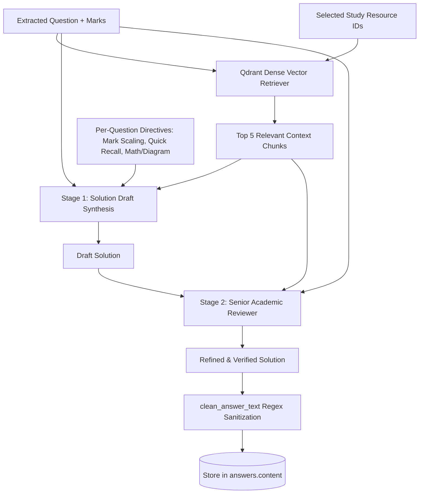

# 07. Core Features & Algorithmic Logic

## 🧠 1. Two-Stage Grounded RAG Synthesis Engine

The core intelligence of AcademicStack resides in the Two-Stage RAG Pipeline in [app/rag/service.py](file:///d:/Shoaib/AcademicStack/as-backend/app/rag/service.py). Rather than relying on a single raw LLM completion, AcademicStack enforces a drafting-and-grading architecture modeled on university examination board evaluation standards.



---

### The Two-Stage Process

#### Stage 1: Initial Solution Draft (`DRAFT_SYSTEM_INSTRUCTION`)
The initial stage focuses on grounded explanation and student memorization:
1. **Plain-English Opening:** Concepts must first be introduced in everyday English (1–3 sentences), explaining what the concept is and what it does or does not involve.
2. **Preserving Syllabus Keywords:** Crucial technical terms (e.g. "**Scope**", "**Approach**", "**Deliverables**") are preserved as bold point titles, as university examiners grade directly against keyword presence.
3. **Structured Components:** Explanations follow with concise bullet points and practical everyday examples (e.g. "using protocols such as MQTT, HTTP, or CoAP").

#### Stage 2: Senior Academic Reviewer (`REVIEWER_SYSTEM_INSTRUCTION`)
The second stage simulates a university grading professor who reviews the draft against the retrieved context:
1. **Audits Grounding:** Verifies that no extraneous facts or ungrounded methods were hallucinated.
2. **Enforces Mark Scaling:** Aggressively trims over-answered 2-mark questions to prevent wasted exam time, or expands 10-mark questions into thorough subsections.
3. **Validates Mermaid Syntax:** Checks that diagram syntax is valid (`flowchart TD`, `sequenceDiagram`, `stateDiagram-v2`, `erDiagram`) and prevents truncated brackets.
4. **Verifies Mathematical Working:** For numerical problems, guarantees that calculations include intermediate steps and a clearly stated final answer.

---

### Mark-Based Length Scaling & ⚡ 2-Min Quick Recall

Every generated answer strictly respects mark proportionality:

```
> **⚡ 2-Min Quick Recall (Exam-Hall TL;DR)**
> - **[Core Term / Formula]**: Crisp 1-sentence definition or formula.
> - **[Key Mechanism / Distinction]**: Crisp 1-sentence explanation of working or primary distinction.
> - **[High-Yield Exam Takeaway]**: 1-sentence critical exam point or pitfall to avoid.
```

| Mark Tier | Target Word Count | Architectural Requirements | Disallowed Elements |
| :---: | :---: | :--- | :--- |
| **2 Marks** | ~60–100 words | 1 plain-English definition sentence + strictly 2 bullet points with bold keywords | NO diagrams, NO subheadings (`###`), NO filler essays |
| **5–7 Marks** | ~200–300 words | Core explanation (2–3 sentences) + 1 concise diagram/flow + 4–6 clear bullet points | Over-bloated essays, redundant introductory filler |
| **10+ Marks** | ~450–600 words | In-depth concept foundation + **Mandatory Mermaid Diagram** + structured subsections with `###` + step-by-step mechanism + **Pros & Cons / Trade-offs** | Single-paragraph summaries, missing diagrams |

---

### Numerical & Mathematical Solving Protocol
If an exam question asks to compute, calculate, or solve a numerical problem (such as Fuzzy Set Operations, Max-Min Composition, Bayes Theorem, or Defuzzification):
- The model is **strictly forbidden** from returning theory only.
- It must state the formula first, display intermediate calculation matrices/steps, and clearly isolate the final answer.
- If specific values are not provided in the paper, it generates a small, labeled example dataset and solves it completely.

---

## 🔮 2. Zero-Assumption Exam Paper Predictor Engine

Implemented in [app/predictor/service.py](file:///d:/Shoaib/AcademicStack/as-backend/app/predictor/service.py), the predictor forecasts upcoming examination papers by auditing historical past papers without rigid hardcoded templates.

### The Two-Phase Discovery Process

```
┌────────────────────────────────────────────────────────────────────────┐
│                   PHASE 1: DYNAMIC BLUEPRINT AUDIT                     │
│                                                                        │
│  - Reads up to 10 past exam papers.                                    │
│  - Extracts exact university heading, time allowed, maximum marks.     │
│  - Discovers total main questions (e.g. Q.1 to Q.6).                   │
│  - Discovers sub-question patterns (a, b, c vs sub-parts like a(i)).   │
│  - Calculates choice pool ratios (e.g. Answer any 4 of 6).             │
│  - Analyzes recurring syllabus modules and topic cadences.             │
└────────────────────────────────────────────────────────────────────────┘
                                    ▼
┌────────────────────────────────────────────────────────────────────────┐
│               PHASE 2: PREDICTED QUESTION PAPER SYNTHESIS              │
│                                                                        │
│  - Replicates exact main question counts and sub-question labeling.    │
│  - Strictly adheres to the Choice Questions Mandatory Pool Rule.       │
│  - Formulates high-probability questions matching university tone.     │
│  - Computes prediction likelihood percentages and trend tags.          │
│  - Returns clean, structured JSON ready for PDF export or QB clone.    │
└────────────────────────────────────────────────────────────────────────┘
```

### The "Choice Questions" Mandatory Pool Rule
A critical flaw in standard AI exam generators is generating only the required number of answers. For example, if a paper states *"Q.1 Answer any four (05 marks each)"*, naive AI generates only 4 questions.
AcademicStack's engine enforces the **Mandatory Pool Rule**:
- If the past papers provided 6 options (a to f) so students had a real choice, the synthesizer **must generate all 6 sub-questions**.
- If a short-notes section states *"Write short notes on any four"*, the engine generates all 5 or 6 options.

---

## 📄 3. Multi-Paper Layout Parser & Vision OCR Fallback

Implemented in [app/parsing/question_parser.py](file:///d:/Shoaib/AcademicStack/as-backend/app/parsing/question_parser.py) and [app/llm/router.py](file:///d:/Shoaib/AcademicStack/as-backend/app/llm/router.py):

### 1. Group Header Mark Inheritance
University examination papers frequently format questions under group headers:
```
Q.1 Answer the following. [20 Marks]
  a. Define fuzzy membership. (Inherits 2M)
  b. State De Morgan's Law.   (Inherits 2M)
```
The parser's system instruction enforces that sub-questions inherit group marks rather than allowing LLM complexity heuristics to override them.

### 2. Digital Text Extraction vs Vision OCR Fallback
Scanned university PDFs often contain corrupted font encoding tables or unmapped font glyphs. AcademicStack tests extracted text with `_is_readable_text(text)`:
- Checks if alphanumeric characters count is $\ge 30$.
- Checks if English vowel count is $\ge 8$.
- If readability checks fail, the engine renders high-resolution page pixmaps via `fitz.open().load_page().get_pixmap()` and routes page images to **OpenAI Vision** (`gpt-4o-mini` / `gpt-4o`) for automated OCR transcription before question extraction.

---

## 🖨️ 4. ReportLab Multi-Format PDF Engines

AcademicStack incorporates four distinct PDF layout engines under [app/pdf/](file:///d:/Shoaib/AcademicStack/as-backend/app/pdf/):

### 1. Project-Owned TrueType Font Registration ([fonts.py](file:///d:/Shoaib/AcademicStack/as-backend/app/pdf/fonts.py))
To ensure that generated PDFs render byte-for-byte identically across Windows development machines and Linux Docker containers, AcademicStack bundles the complete DejaVu TrueType family under `app/pdf/assets/fonts/`:
- **`ASSerif`** (`DejaVuSerif.ttf`): Elegant academic body serif.
- **`ASSans`** (`DejaVuSans.ttf`): Clean modern headings and title text.
- **`ASMono`** (`DejaVuSansMono.ttf`): Fixed-width code blocks, matrices, and ASCII diagrams.
- Fully wired via `pdfmetrics.registerFontFamily` so `<b>` and `<i>` tags automatically resolve to bold and italic TrueType faces.

### 2. Full Solved Question Book Engine ([generator.py](file:///d:/Shoaib/AcademicStack/as-backend/app/pdf/generator.py))
- Compiles formal university cover page with subject metadata, course codes, and generated dates.
- Formats question headers with marks badges.
- Renders KaTeX LaTeX mathematical formulas as crisp embedded flowables via [mathrender.py](file:///d:/Shoaib/AcademicStack/as-backend/app/pdf/mathrender.py).
- Applies two-pass page numbering (`Page X of Y`).

### 3. 2-Column Examination Cheatsheet Engine ([cheatsheet_generator.py](file:///d:/Shoaib/AcademicStack/as-backend/app/pdf/cheatsheet_generator.py))
- Designed for rapid last-minute revision before entering the exam hall.
- Implements a dual-column `Frame` layout on A4 paper with tight gutters and compact paragraph leading.
- Prioritizes the ⚡ 2-Min Quick Recall snippets, key formulas, and core bullet points.

### 4. University Model Examination Paper Engine ([predicted_paper_generator.py](file:///d:/Shoaib/AcademicStack/as-backend/app/pdf/predicted_paper_generator.py))
- Formats an authentic university examination sheet.
- Features university headers, course codes, duration and maximum marks headers, student roll number entry boxes, and candidate instructions.
